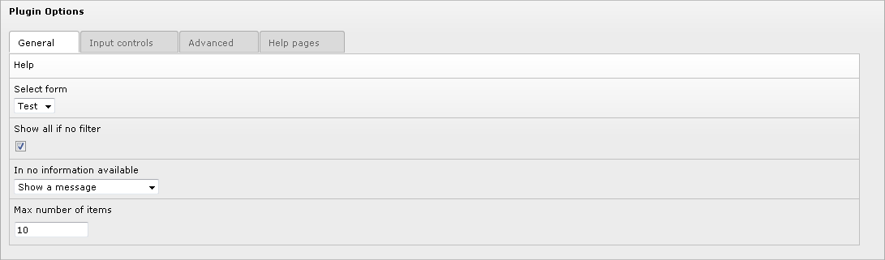
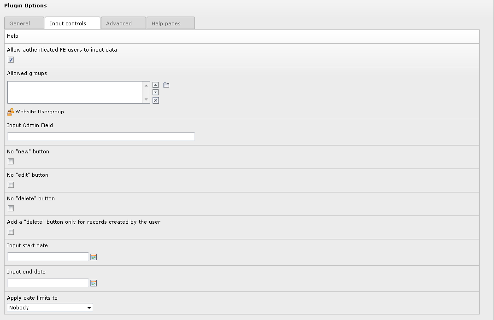
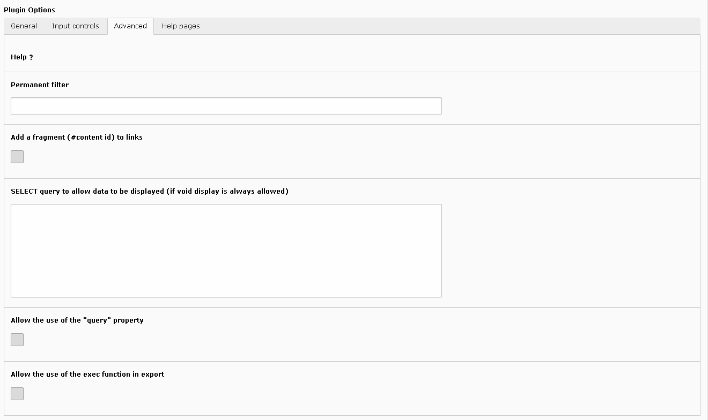
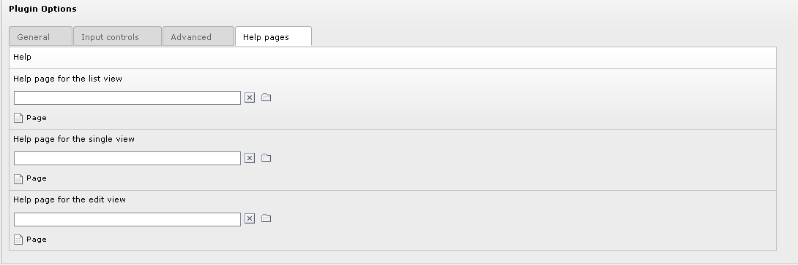

.. include:: ../../Includes.txt

.. _flexformAssociatedWithThePlugin:

===================================
Flexform Associated With the Plugin
===================================

The configuration of **each generated extension** is done by means of
a flexform. The flexform has four folders:

- General

- Input controls

- Advanced

- Help pages

.. _flexformAssociatedWithThePlugin.generalFolder:

General Folder
==============

#. **Help**: click on the word **Help** to access to this section 
   of the documentation.

#. **Select form**: use this selector to select the form name. Let use
   recall that the `sav_library_plus
   <https://extensions.typo3.org/extension/sav_library_plus>`_ makes it possible 
   to build several forms associated with the same extension, thus providing
   different views of your tables.

#. **Show all if no filter**: if set, all items are displayed if no
   filter is applied, for example by means of the `sav_filters 
   <https://extensions.typo3.org/extension/sav_filters>`_
   extension.

#. **If no information available**: use the selector to choose what to
   display when no information are available.

#. **Max number of items** : maximum number of items that will be
   displayed in a page. If set to 0, all items are displayed.
   
.. _flexformAssociatedWithThePlugin.inputControlsFolder:   
   
Input Controls Folder
=====================  

#. **Help**: click on the word **Help** to access to this section 
   of the documentation.

#. **Allow authenticated FE users to input data**: if set, frontend 
   inputs are allowed by authenticated users (set by default).

#. **Allowed groups**: if you select user groups, user must belong to
   one of these groups to be allowed to input data in the frontend.

#. **Input Admin field**: put here a field under the form
   **tableName.fieldName** (if you use only **fieldName**, the main table is
   taken as **tableName**). This will restrict the input to users that have
   **Admin** right for this field in their TSConfig. For example, if one
   user has **extKey_Admin=value1,value2** in his TSConfig, he/she will
   be allowed to edit or delete items for which **fieldName** is equal to
   **value1** or **value2** for the extension **extKey**. The fields or the
   folders which have the attribute **editAdminPlus= 1;** can be modified
   if the user has the **Admin+** rights. For example, if the TSConfig is
   **extKey_Admin=value1+,value2** , the user is an **Admin+** for the
   records where **fieldName** is equal to **value1** and just **Admin** for
   the records where **fieldName** is equal to **value2**. Users become
   **Super Admin** if their TSConfig is **extKey_Admin=\***.
   
   .. note::
   
      Two special entries are also allowed:
      
      - **fe_users.uid**: it may be used if the main table is **fe_users**.
        In this case, access is granted if the authenticated frontend 
        user **uid** is the same as the main table **uid** 
        (see :ref:`Tutorial 8 <tutorial8>` for an example).
        
      - **cruser_id** or **your_main_table.cruserd_id**: in this case, the access
        is granted if the authenticated frontend user has created the current 
        record, i.e. its **uid** is equal to the **cruser_id** field in the
        current record.
        

#. **No “new” button**: no new button is added to the form. It means
   that you can modify existing records but you cannot create new record.

#. **No “edit” button**: an edit button will not be added in front of
   the records in **List** views.

#. **No “delete” button**: a delete button will not be added in front of
   the records in **List** views.

#. **Add a “delete” button only for records created by the user** : add a
   **delete** button only for records created by the user.

#. **Input start date**: if set, inputs in the frontend will not be
   possible before this date.

#. **Input end date**: if set, inputs in the frontend will not be
   possible after this date.

#. **Apply date limit**: use the selector to set either **Nobody**, **All**,
   **Admin plus users**, **All excluding Super Admin**. The date limit is
   applied according to this selector.
   
.. _flexformAssociatedWithThePlugin.advancedFolder:   
   
Advanced Folder
===============

#. **Help**: click on the word **Help** to access to this section 
   of the documentation.

#. **Permanent filter**: you can use this field to add a WHERE clause
   part to the WHERE clause of the form query.

#. **Add a fragment (# content id) to links**: the content id is added
   as a fragment to the links.
   
#. **SELECT query to allow data to be displayed (if void display is 
   always allowed)**: the SELECT query entered in this field is used 
   to check if data can be displayed. It the query result is not empty
   the access is granted. It may be used in very specific cases to protect
   access to the data. Because it is very specific, for security reasons, 
   only admin users can fill this field when needed.

#. **Allow the use of the “query” property**: the **query** property makes
   it possible to execute queries in **Edit** or **Update** views. Because
   any query may be executed, for security reasons, only admin users can
   check this field when this property is needed.

#. **Allow the use of the exec function in export**: The use of the php
   exec function is allowed in export which makes the execution of text
   processors possible, for example.

.. _flexformAssociatedWithThePlugin.helpPagesFolder:  

Help Pages Folder
=================

#. **Help**: click on the word **Help** to access to this section of 
   the documentation.

#. **Help page for the List view**: use this selector to choose a page
   of your site which will be use as a help page for the **List** view. In
   this case, an icon is displayed in the title bar of your extension.

#. **Help page for the Single view**: use this selector to choose a page
   of your site which will be use as a help page for the single view. In
   this case, an icon is displayed in the title bar of your extension.

#. **Help page for the Edit view**: use this selector to choose a page
   of your site which will be use as a help page for the edit view. In
   this case, an icon is displayed in the title bar of your extension.
