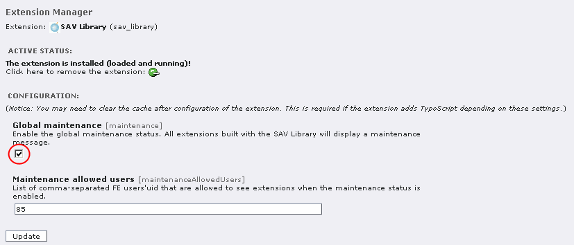

.. include:: ../../Includes.txt

.. _maintenanceConfigurations:

==========================
Maintenance Configurations
==========================

The SAV Library Extension Generator includes flags to deal with
maintenance operation.

A global maintenance flag is available at the SAV Library Plus level
using the Extension Manager. If you check the flag, a maintenance
message will be displayed by all extensions built with the SAV Library
Plus and filters will not be displayed.

If you provide a list of users'id, separated by a comma, then these
users will still see the extensions and the filters.

Global maintenance is useful for developers when global changes are
performed on the SAV Library Plus.

