.. include:: ../Includes.txt

.. _introduction:

============
Introduction
============

What Does it Do?
================

The SAV Library Plus is the library required to run extension
generated by means of the `SAV Library Kickstarter 
<https://extensions.typo3.org/extension/sav_library_kickstarter>`_ when the library
type **plus** is used.

The SAV Library Kickstarter generates extensions **without any PHP
coding**, thanks to simple configuration parameters. It includes:

- Creation of multiple views of the data,
- Frontend input of the data,
- Views with folders,
- Simple interface in the Kickstarter with Context Sensitive Help,
- Generation of emails,
- Generation of RTF files using database tags,
- Data export in CSV format,
- Many other features.

The latest developments of the SAV Library Plus extension are
available in GitHub ( `SAV Library Plus
<https://github.com/YolfTypo3/SavLibraryPlus>`_ ).

Related Extensions
==================

Several examples of extensions generated by the SAV Library are
available in the TER.

- SAV Library Examples (**sav_library_exampleX**, where X is a number) -
  these extensions are described in the tutorial section.
- Other examples can be found in the :ref:`Other examples <otherExamples>` section of this
  manual: Downloading documents (sav_download), Minutes of meetings (sav_meetings). 

.. important::

   The latest developments of the examples are 
   available in GitHub ( `SAV Library Kickstarter Examples
   <https://github.com/YolfTypo3/SavLibraryKickstarterExamples>`_ ).
   
The extension `sav_filters <https://extensions.typo3.org/extension/sav_filters>`_ 
provides filters to work with the extensions generated for the SAV Library Plus or
the SAV Library Mvc.

Screenshots
===========

The following screenshots come from the SAV Library Examples. 
The example #X is related with the exentension sav_library_exampleX 
and is described in the tutorial #X section of this manual.

Example 1 – Creating Text and Image
-----------------------------------

List View
~~~~~~~~~

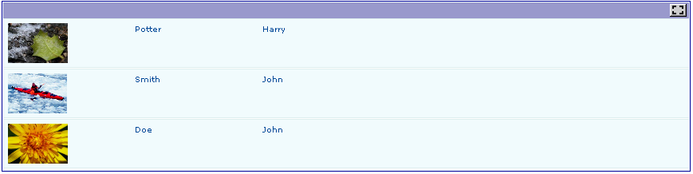

Single View
~~~~~~~~~~~

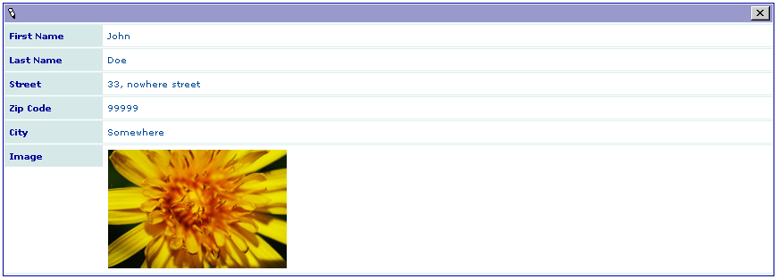

Edit View
~~~~~~~~~

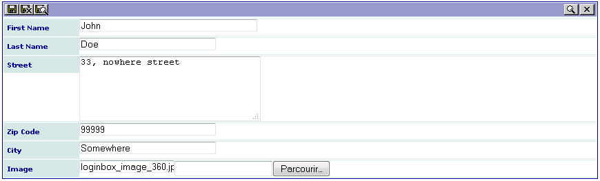

Example 2 – Creating Link, Text Area, Selector
----------------------------------------------

List View
~~~~~~~~~

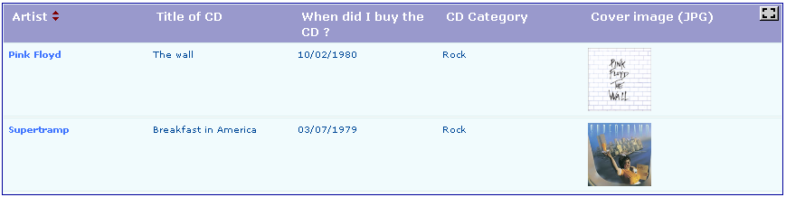

Single View
~~~~~~~~~~~

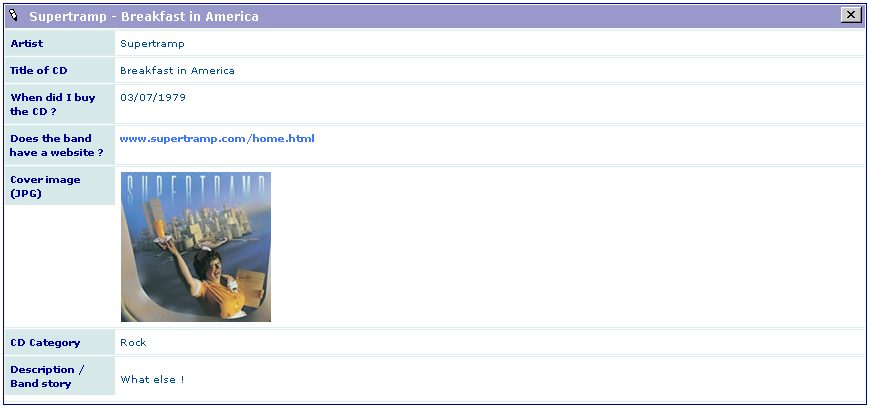

Edit View
~~~~~~~~~

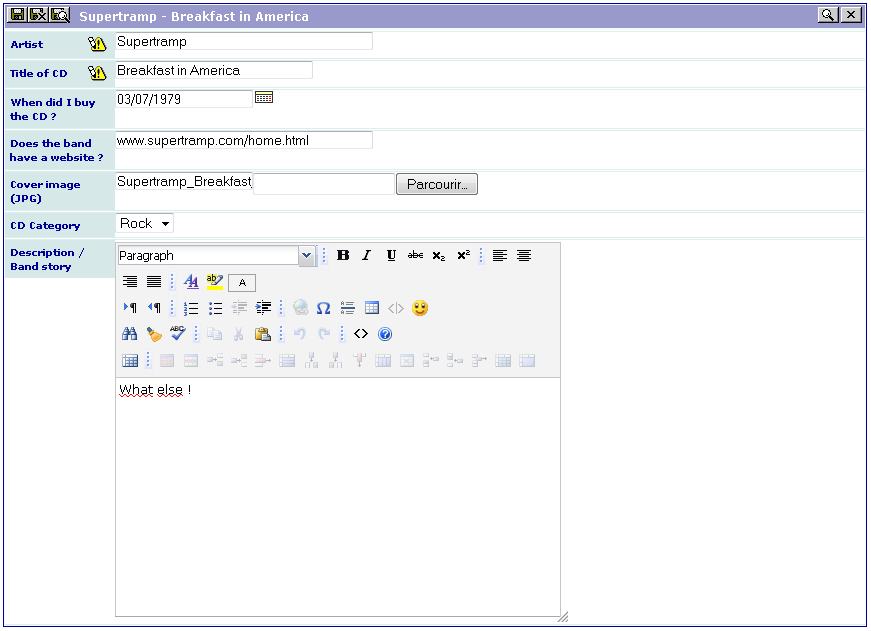

Example 3 – Creating Folders, MM Table in a Subform
----------------------------------------------------

Single View
~~~~~~~~~~~

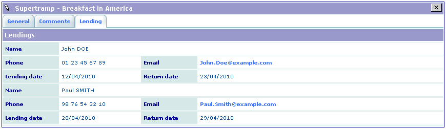

Edit View
~~~~~~~~~

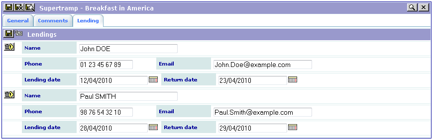

Example 4 – Double-Window Selector, Table in a Subform Which is not in Relation With Items
-------------------------------------------------------------------------------------------

Single View
~~~~~~~~~~~

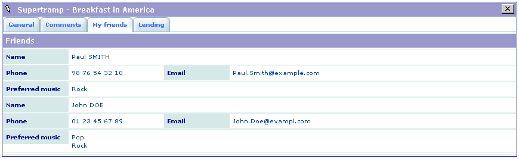

Edit View
~~~~~~~~~

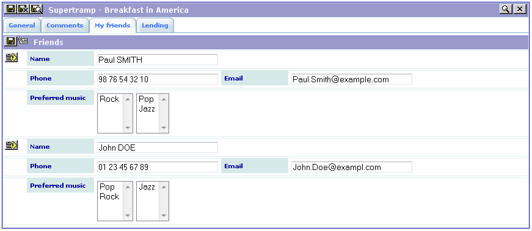

Example 6 – Email and RTF
-------------------------

Edit View
~~~~~~~~~

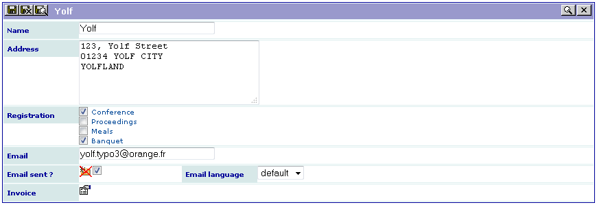

Example 7 – Guest Book (Multiple Forms)
---------------------------------------

Guest Form (Edit View)
~~~~~~~~~~~~~~~~~~~~~~

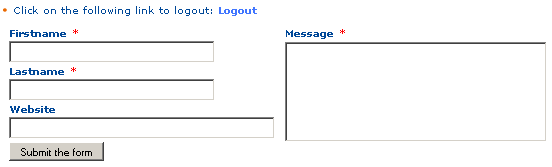

Guest Inputs Validation (List and Edit Views)
~~~~~~~~~~~~~~~~~~~~~~~~~~~~~~~~~~~~~~~~~~~~~

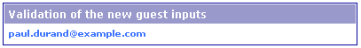

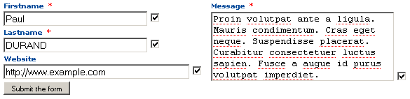

List View
~~~~~~~~~

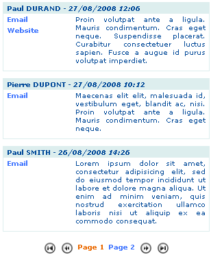

Teaser View
~~~~~~~~~~~

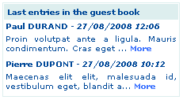

Example 8 – Fe Users Admin and Export
-------------------------------------

List View of the ADMIN Form With Export Icon
~~~~~~~~~~~~~~~~~~~~~~~~~~~~~~~~~~~~~~~~~~~~

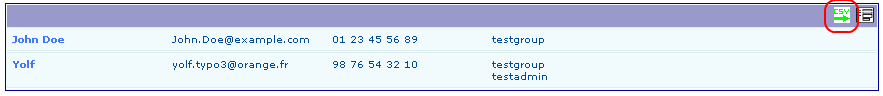

Export View Using a Previously Saved Configuration
~~~~~~~~~~~~~~~~~~~~~~~~~~~~~~~~~~~~~~~~~~~~~~~~~~

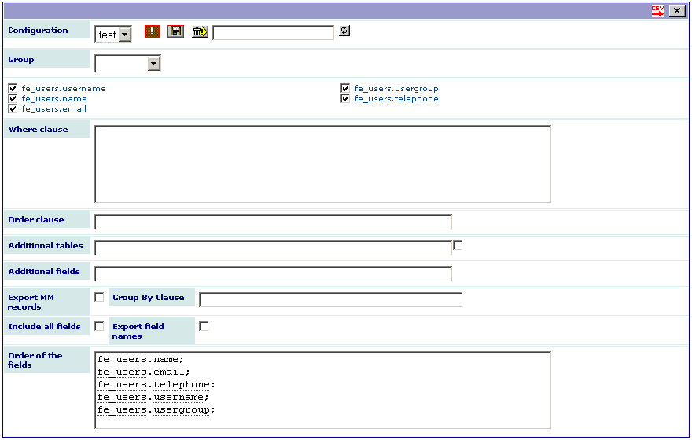

Example 9 – XML Graph
---------------------

.. figure:: ../Images/ScreenshotsExample9SingleView.png

Example10 – Using TypoScript (Gallery With a Map)
------------------------------------------------------

List View
~~~~~~~~~

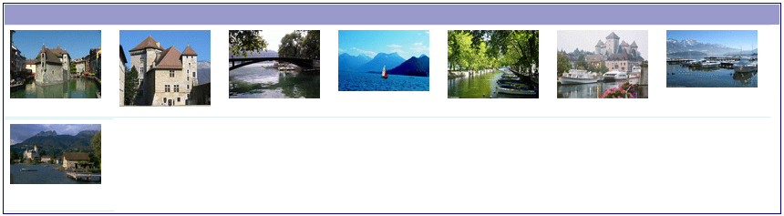

Single View With a Map
~~~~~~~~~~~~~~~~~~~~~~~~~~~~~

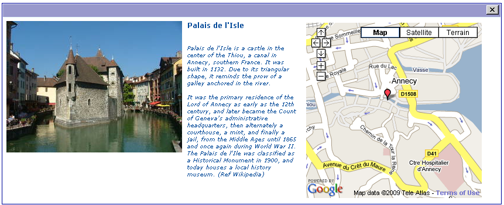

