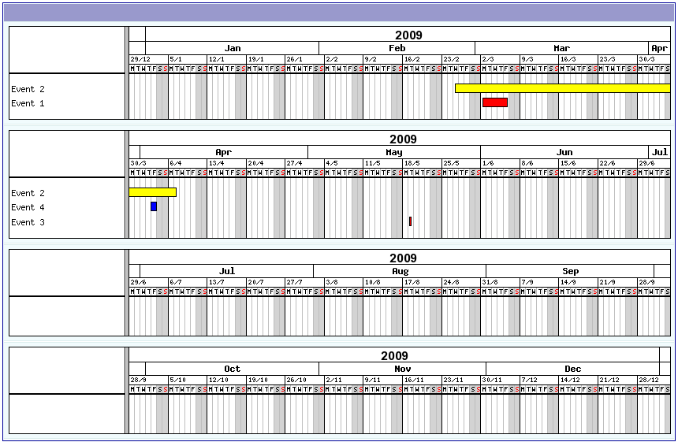

.. ==================================================
.. FOR YOUR INFORMATION
.. --------------------------------------------------
.. -*- coding: utf-8 -*- with BOM.

.. ==================================================
.. DEFINE SOME TEXTROLES
.. --------------------------------------------------
.. role::   underline
.. role::   typoscript(code)
.. role::   ts(typoscript)
   :class:  typoscript
.. role::   php(code)

Introduction
============

What does it do?
----------------

The SAV Library Plus is the library required to run extension
generated by means of the `SAV Library Kickstarter <https://typo3.org/e
xtensions/repository/view/sav_library_kickstarter>`_ when the library
type “**plus**” is used.

The SAV Library Kickstrater generates extensions **without any PHP
coding**, thanks to simple configuration parameters. It includes:

- Creation of multiple views of the data,
- Front end input of the data,
- Views with folders,
- Simple interface in the Kickstarter with Context Sensitive Help,
- Generation of emails,
- Generation of RTF files using database tags,
- Data export in CSV format,
- Many other features.

The latest developments of the SAV Library Plus extension are
available GitHub ( `SAV Library Plus
<https://github.com/YolfTypo3/SAV-Library-Kickstarter-Project>`_ ).

Related extensions
------------------

Several examples of extensions generated by the SAV Library are
available in the TER.

- SAV Library Examples (“sav\_library\_exampleX”, where X is a number) -
  these extensions are described in the tutorial section.
- Other examples can be found in the “Other examples” section of this
  manual: Downloading documents (sav\_download), Minutes of meetings (sav\_meetings).
- SAV Library Filters (“sav\_filter\_name”, where name is the filter
  name) - these extensions are specially designed to work with the
  extensions generated by the SAV Library Plus.

Screenshots
-----------

The following screenshots come from the SAV Library Examples. The example #X is related with the exentension sav_library_exampleX and is described in the tutorial #X section of this manual.

Example 1 – creating text and image
^^^^^^^^^^^^^^^^^^^^^^^^^^^^^^^^^^^

List view
"""""""""

.. figure:: ../Images/ScreenshotsExample1ListView.png

Single view
"""""""""""

.. figure:: ../Images/ScreenshotsExample1SingleView.png

Edit view
"""""""""

.. figure:: ../Images/ScreenshotsExample1EditView.png

Example 2 – creating link, text area, selector
^^^^^^^^^^^^^^^^^^^^^^^^^^^^^^^^^^^^^^^^^^^^^^

List view
"""""""""

.. figure:: ../Images/ScreenshotsExample2ListView.png

Single View
"""""""""""

.. figure:: ../Images/ScreenshotsExample2SingleView.png

Edit view
"""""""""

.. figure:: ../Images/ScreenshotsExample2EditView.png

Example 3 – creating folders, MM table in a sub-form
^^^^^^^^^^^^^^^^^^^^^^^^^^^^^^^^^^^^^^^^^^^^^^^^^^^^

Single view
"""""""""""

.. figure:: ../Images/ScreenshotsExample3SingleView.png

Edit view
"""""""""

.. figure:: ../Images/ScreenshotsExample3EditView.png

Example 4 – Double-window selector, table in a sub-form which is not in relation with items
^^^^^^^^^^^^^^^^^^^^^^^^^^^^^^^^^^^^^^^^^^^^^^^^^^^^^^^^^^^^^^^^^^^^^^^^^^^^^^^^^^^^^^^^^^^

Single view
"""""""""""

.. figure:: ../Images/ScreenshotsExample4SingleView.png

Edit view
"""""""""

.. figure:: ../Images/ScreenshotsExample4EditView.png

Example 6 – Email and RTF
^^^^^^^^^^^^^^^^^^^^^^^^^

Edit view
"""""""""

.. figure:: ../Images/ScreenshotsExample6EditView.png

Example 7 – Guest book (multiple forms)
^^^^^^^^^^^^^^^^^^^^^^^^^^^^^^^^^^^^^^^

Guest form (edit view)
""""""""""""""""""""""

.. figure:: ../Images/ScreenshotsExample7GuestEditView.png

Guest inputs validation (list and edit views)
"""""""""""""""""""""""""""""""""""""""""""""

.. figure:: ../Images/ScreenshotsExample7GuestValidationListView.png

.. figure:: ../Images/ScreenshotsExample7GuestValidationEditView.png

List view
"""""""""

.. figure:: ../Images/ScreenshotsExample7ListView.png

Teaser view
"""""""""""

.. figure:: ../Images/ScreenshotsExample7TeaserView.png

Example 8 – Fe Users Admin and Export
^^^^^^^^^^^^^^^^^^^^^^^^^^^^^^^^^^^^^

List view of the ADMIN form with export icon
""""""""""""""""""""""""""""""""""""""""""""

.. figure:: ../Images/ScreenshotsExample8ListView.png

Export view using a previously saved configuration
""""""""""""""""""""""""""""""""""""""""""""""""""

.. figure:: ../Images/ScreenshotsExample8ExportView.png

Example 9 – XML JpGraph (year events display as Gantt graphs)
^^^^^^^^^^^^^^^^^^^^^^^^^^^^^^^^^^^^^^^^^^^^^^^^^^^^^^^^^^^^^

Example10 – Using TypoScript (gallery with google map)
^^^^^^^^^^^^^^^^^^^^^^^^^^^^^^^^^^^^^^^^^^^^^^^^^^^^^^

List view
"""""""""

.. figure:: ../Images/ScreenshotsExample10ListView.png

Single view with a google map
"""""""""""""""""""""""""""""

.. figure:: ../Images/ScreenshotsExample10SingleView.png

