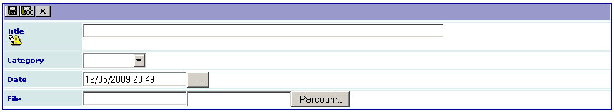

.. include:: ../Includes.txt

.. _otherExamples:

==============
Other examples
==============

If you have reached this part of this manual, you are familiar with
form and field configurations.

This section describes simple or more complex examples that were
designed to answer to specific problems. Most often, they are used
as tools for an intranet. They are shared with the TYPO3 community to
illustrate the simplicity and the power of the SAV Library Kickstarter. 
They are provided as it and will probably have no updated version. 
Download extensions from GitHub, open them in the SAV Library Kickstarter,
analyze the configurations and adapt them to your problem.

In the following, each extension will be shortly described and
illustrated by several screenshots. Useful information are provided
when needed.

Downloading documents (sav_download)
=====================================

What Does it Do?
----------------

The extension `sav_download 
<https://extensions.typo3.org/extension/sav_download>`_
is a very simple extension which makes it possible to download documents. A
new icon indicates the new documents during 15 days and icons are
associated with the file type (see the field configurations). Sorting
is available by clicking on ``Date`` or ``Category`` in the title bar.

Screenshots
-----------

.. figure:: ../Images/OtherExamplesSavDownloadListView.png

Minutes of Meetings (sav_meetings)
===================================

What Does It Do?
----------------

The extension `sav_meetings 
<https://extensions.typo3.org/extension/sav_meetings/>`_
was designed to enter and display the minutes of a
meeting for a group of frontend users, for example a management team or a
development team. Each member of the group may enter items that will
be discussed during the meeting. A meeting has a date and belongs to a
category (for example a project for a development team). An item is
proposed by a member of the group. It has a name and an expected
duration. A report is associated with it. Up and down icons are
displayed to reorganize the items. A delete icon makes it possible to
delete one item. A save button with an anchor is displayed to make the
saving more comfortable when the minutes are taken during the meeting.

Useful Information
------------------

By default the group of frontend users is ``sav_meetings``. The selectors for
the ``participants`` and the ``proposed_by`` fields filter the ``fe_users``
table with this group. See the configuration of these fields for the
``Edit`` view. It includes the following property:

::

   whereSelect=###group_list=sav_meetings###;

If you do not want to use this group name nor modify the extension,
you can overload this property using the facility provided by the SAV
Library Extension Generator (see: Changing the field configuration ).
Edit the page properties and add the following lines in the TSConfig
field (see the folder tab ``Options`` in the flexform of the page
properties). The group that will be used is now ``testgroup``.

::

   tx_savmeetings.Meetings.editView.fields.participants.whereSelect = ###group_list=testgroup###
   tx_savmeetings.Meetings.editView.fields.tx_savmeetings_item.proposed_by.whereSelect = ###group_list=testgroup###

Screenshots
-----------

.. figure:: ../Images/OtherExamplesSavMeetingsSingleView.png