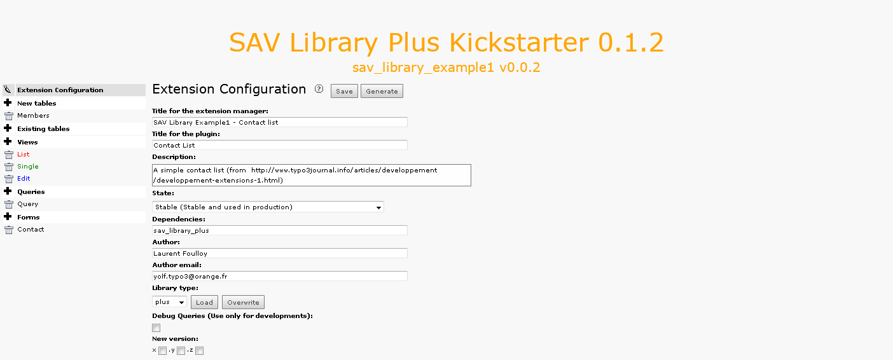
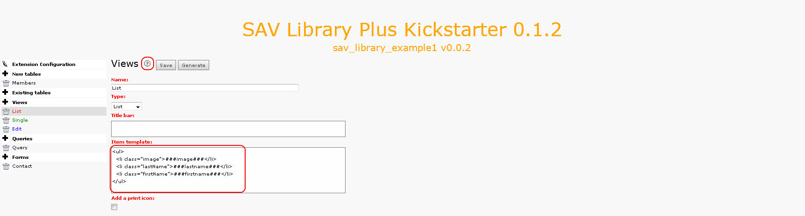
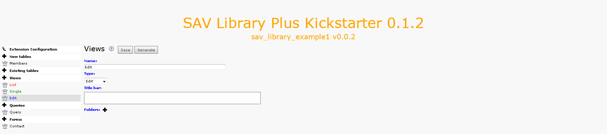
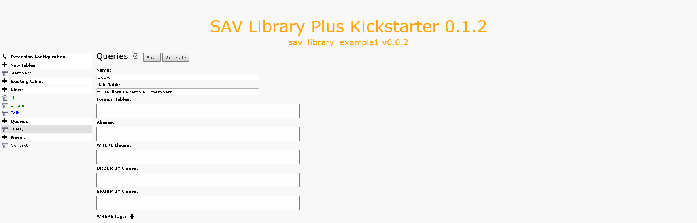
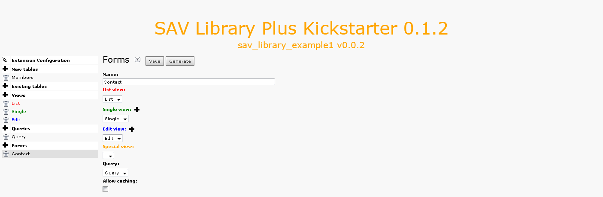
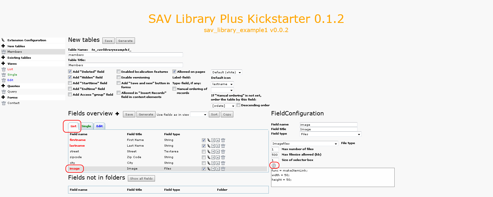

.. ==================================================
.. FOR YOUR INFORMATION
.. --------------------------------------------------
.. -*- coding: utf-8 -*- with BOM.

.. ==================================================
.. DEFINE SOME TEXTROLES
.. --------------------------------------------------
.. role::   underline
.. role::   typoscript(code)
.. role::   ts(typoscript)
   :class:  typoscript
.. role::   php(code)

Extension Overview
------------------

Extension configuration
^^^^^^^^^^^^^^^^^^^^^^^

Views
^^^^^

This extension relies on three views:

- A list view, named “List”, which displays all the items associated
  with the query,

- A single view, named “Single”, which displays only information
  associated with one item,

- An edit view, named “Edit” which makes it possible to edit an item in
  the front end.

Let us note that most extensions deal with one form with three views:
one list view to present items, one single view to display one item
and one edit view to edit one item. However, an extension may only
have one list view. It can also contain several forms with different
views as it is explained in Tutorial 7. Click on the List view to open
it.

The item template defines how each item will be displayed. In general,
it is an <ul> list with <li> elements which contain the fields to
display. Fields must be written as markers ###fieldname###.

Click on the help icon to get more information.

Then, click on the Single and Edit views where no specific
configurations are required.

.. figure:: ../../Images/Tutorial1KickstarterSingleView.png

Queries
^^^^^^^

Each form has an associated query to select the items that will be
displayed in the List view. Use the “Context Sensitive Help” icon to
get  **the description associated with each field** .

Forms
^^^^^

The “Forms” section is the place where the forms are specified, i.e.
the views and the query are selected. Use the “Context Sensitive Help”
icon to get  **the description associated with each field** .

Field configuration
^^^^^^^^^^^^^^^^^^^

A specific configuration can be provided for each field in each view.
Configuration are available in the database table. Click on the data
base table. Three tabs associated with your three views have been
generated. By clicking on a tab, then on a field you will see the
configuration parameters of all the field for the selected view. The
“Context Sensitive Help” icon provides on line information about the
allowed attribute for the field type (see also the SAV Library
Kickstarter for the description of the attributes).

