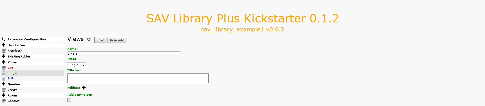

.. include:: ../../Includes.txt

.. _tutorial1_extensionOverview:

==================
Extension Overview
==================

Extension Configuration
=======================

Views
-----

This extension relies on three views:

- A ``List`` view which displays all the items associated
  with the query,

- A ``Single`` view which displays only information
  associated with one item,

- An ``Edit`` view which makes it possible to edit an item in
  the frontend.

Let us note that most extensions deal with one form with three views:
one view to list the items, one view to display an item
and one view to edit an item. However, an extension may only
have one ``List`` view. It can also contain several forms with different
views as it is explained in :ref:`Tutorial 7 <tutorial7>`. 
Click on the ``List`` view to open it.

The item template defines how each item will be displayed. In general,
it is an <ul> list with <li> elements which contain the fields to
display. Fields must be written as markers ``###fieldname###``.

Click on the help icon to get more information.

Then, click on the ``Single`` and ``Edit`` views where no specific
configurations are required.

Queries
-------

Each form has an associated query to select the items that will be
displayed in the ``List`` view. Use the ``Context Sensitive Help`` icon to
get the description associated with each field.

Forms
-----

The ``Form`` section is the place where the forms are specified, i.e.
the views and the query are selected. Use the ``Context Sensitive Help``
icon to get the description associated with each field.

Field Configuration
-------------------

A specific configuration can be provided for each field in each view.
Configuration are available in the database table. Click on the data
base table. Three tabs associated with your three views have been
generated. By clicking on a tab, then on a field you will see the
configuration parameters of all the field for the selected view. The
``Context Sensitive Help`` icon provides on line information about the
allowed attribute for the field type (see also the :ref:`SAV Library
Kickstarter Reference <savlibrarykickstarter:reference>` 
for the description of the attributes).

