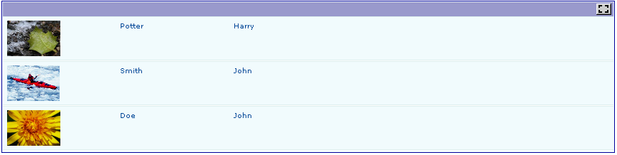
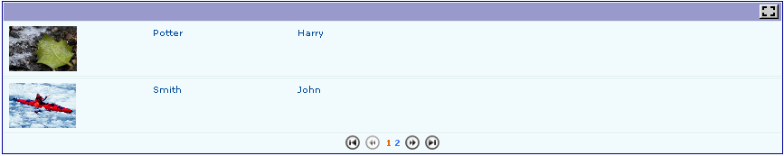
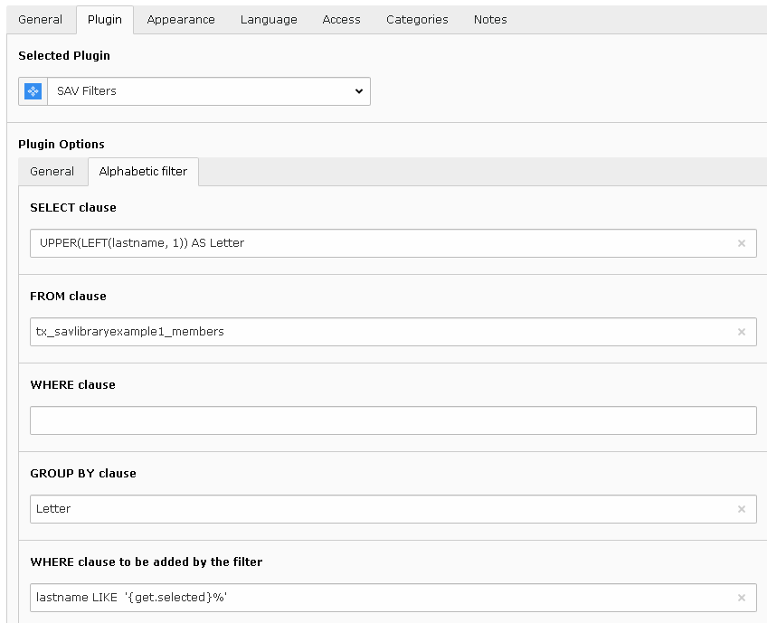
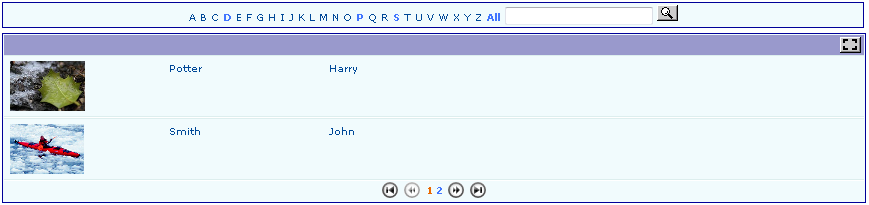
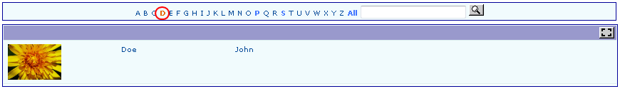

.. ==================================================
.. FOR YOUR INFORMATION
.. --------------------------------------------------
.. -*- coding: utf-8 -*- with BOM.

.. ==================================================
.. DEFINE SOME TEXTROLES
.. --------------------------------------------------
.. role::   underline
.. role::   typoscript(code)
.. role::   ts(typoscript)
   :class:  typoscript
.. role::   php(code)

How to?
-------

How to specify the size of the image?
^^^^^^^^^^^^^^^^^^^^^^^^^^^^^^^^^^^^^

The image is displayed in the “List” and “Single” views. The following
configuration parameters define a 50x50 image, for example in the
“List” view:

- width = 50;

- height = 50;

How to change the number of items displayed by page in the “list” view?
^^^^^^^^^^^^^^^^^^^^^^^^^^^^^^^^^^^^^^^^^^^^^^^^^^^^^^^^^^^^^^^^^^^^^^^

By default, the “Max number of items” in the flexform is set to 10,
just change this number. Setting this number to 0 will display all
items. Using the default configuration, you will get:

Now, if you set “Max number of items” to 2, you will obtain:

How to introduce an alphabetical selector?
^^^^^^^^^^^^^^^^^^^^^^^^^^^^^^^^^^^^^^^^^^

It is often useful to select records based on, for example, the first
letter of the name. The extension “sav\_filter\_abc” was specially
built to deal with this problem.

- Download “sav\_filter\_abc” from the TER,  **read the documentation**
  and install it.

- Add the plugin “sav\_filter\_abc” as a content element in the same
  page as the extension “sav\_library\_example1”.

- Configure the flexform by filling the table name and the field name. A
  Context Sensitive Help is available.

- Save your configuration and go in the Front end.

Only the letters corresponding to the first letter of existing records
can be selected. Click on a letter to select the records.

 

