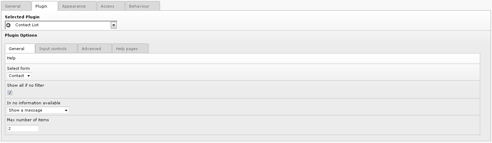
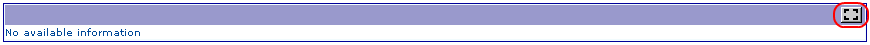
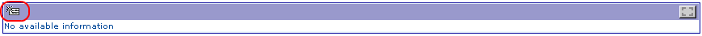
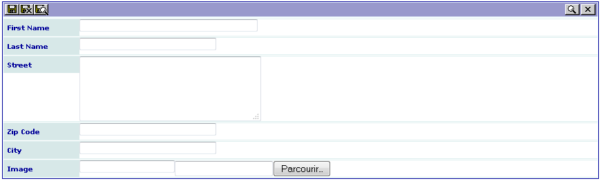
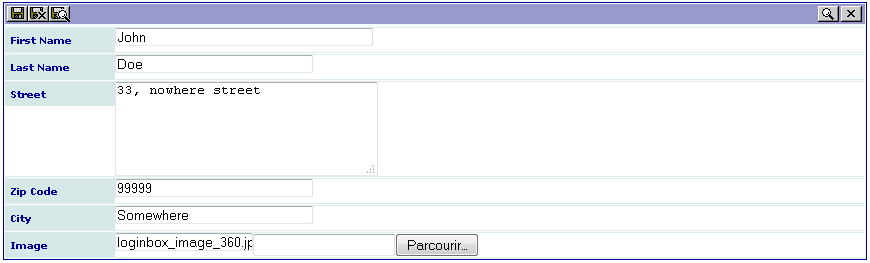
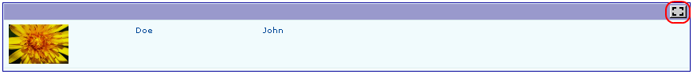
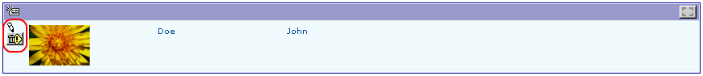
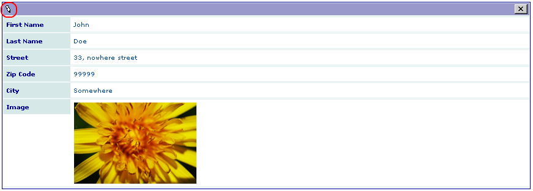

.. ==================================================
.. FOR YOUR INFORMATION
.. --------------------------------------------------
.. -*- coding: utf-8 -*- with BOM.

.. ==================================================
.. DEFINE SOME TEXTROLES
.. --------------------------------------------------
.. role::   underline
.. role::   typoscript(code)
.. role::   ts(typoscript)
   :class:  typoscript
.. role::   php(code)

Using the extension
-------------------

Create a page and insert a plugin content element and select “Contact
list” in the plugin selector.

The configuration of the plugin is performed by means of a flexform
which comes with default values. Just select your form name, that is
“Contact” in the “Select form” selector, change the default values,
save your content element and  **clear the cache** .

Go to your page in the Front End and you should see the following
caption.

Authenticate yourself to be allowed to input data in the Front End.
Now, a new icon should be displayed.

Click on the right icon to enter in the edit mode. A new icon appears
at the left hand side of the form. Click on it to input a new item.

The generated edit view is shown. As it can be seen on the following
caption, the size of the field firstname is longer than the other
fields of the same type. This is due to the configuration parameter
“size = 40;” added for this field. The other fields take the default
configuration of the SAV Library Kickstarter, i.e. a default size of
30.

Fill the form with information. Use the browser to select the image
and save.

When your have completed your input quit the input form. Note that you
can also use the save and close icon. Now, your extension will display
one item in your “List” view.

Click on the “Enter in edit mode” button to add another item, edit the
previous one or suppress it.

Thanks to the attribute “func = makeItemLink;” in the field image of
the “List” view, clicking on the image will open the “Single” view.

Let us note that if you click on the icon on the pencil icon, you will
access to the “Edit” view and be able to edit the content.

