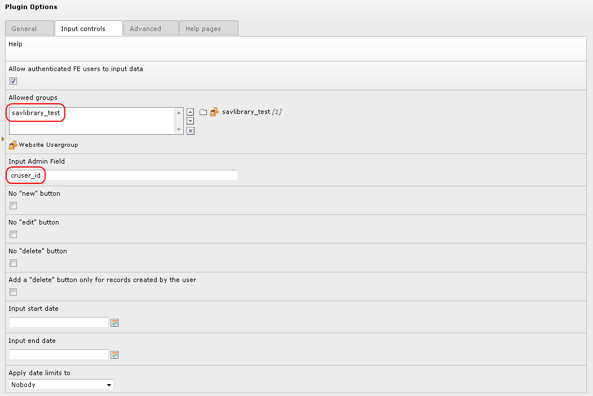

.. ==================================================
.. FOR YOUR INFORMATION
.. --------------------------------------------------
.. -*- coding: utf-8 -*- with BOM.

.. ==================================================
.. DEFINE SOME TEXTROLES
.. --------------------------------------------------
.. role::   underline
.. role::   typoscript(code)
.. role::   ts(typoscript)
   :class:  typoscript
.. role::   php(code)

Configuration of the plugin
---------------------------

The last step is the configuration of the plugin so that the
authenticated users can only modified their images.

This can be simply done by using the “cruser\_id” field in the “Input
Admin Field” of the flexform as shown below.

