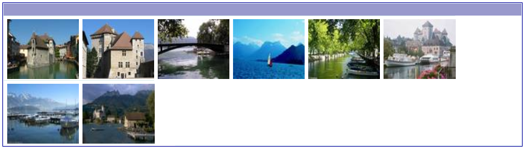
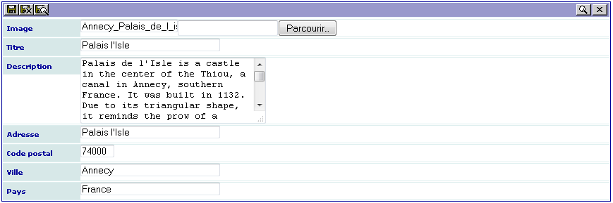
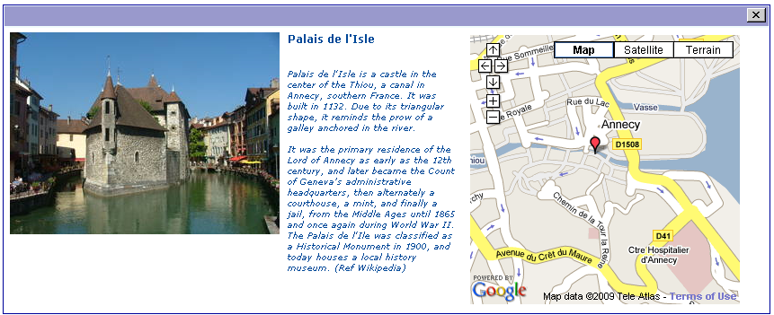

.. include:: ../Includes.txt

.. _tutorial10:

==================================================
Tutorial 10: Using TypoScript (Gallery With a Map)
==================================================

The aim of this tutorial is to show how to use TypoScript into an
extension. In this example, we want to display a gallery of pictures.

We will use three views in only one form for the sake of the simplicity (see
previous examples to create an admin form):

- The ``List`` view to display small images.

- The ``Edit`` view to enter the picture, its title, a description and the
  address corresponding to the picture.

- The ``Single`` view with a special organization. The picture is on the
  left, then the title and the description is displayed at the right of
  the picture and, finally, the map, where the marker is defined
  by the address, goes to the right of the description. By clicking on
  the image, it should be displayed in its original size.

Several authenticated users may use the plugin. Each user can modify
or delete the records he/she has created.

- Download this example from the TER (`sav_library_example10 
  <https://extensions.typo3.org/extension/sav_library_example10>`_) and
  install it.

- Download also the extension `maps2 <https://extensions.typo3.org/extension/maps2>`_ from the TER, read the
  documentation and install it. By default the configuration it set
  to provide maps from `OpenStreetMap <https://www.openstreetmap.org>`_.

Tables of Contents
==================

.. toctree::
   :maxdepth: 5
   :titlesonly:

   ListView/Index
   EditView/Index
   SingleView/Index
   Configuration/Index