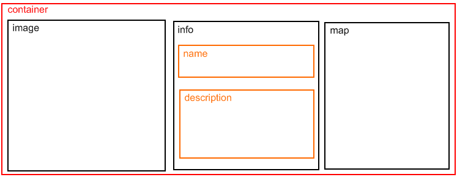
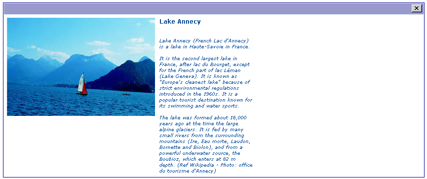

.. ==================================================
.. FOR YOUR INFORMATION
.. --------------------------------------------------
.. -*- coding: utf-8 -*- with BOM.

.. ==================================================
.. DEFINE SOME TEXTROLES
.. --------------------------------------------------
.. role::   underline
.. role::   typoscript(code)
.. role::   ts(typoscript)
   :class:  typoscript
.. role::   php(code)

Single view
-----------

In this view, we have to deal with two problems:

- positioning correctly the fields,

- executing the plugin “wec\_map”.

Positioning the fields
^^^^^^^^^^^^^^^^^^^^^^

The positioning of the fields is very simple in the “List” view
because you can define the template. For the “Single” and “Edit”
views, the positioning can be obtained using the “wrapItem” property.
This property has the same syntax and the same behaviour as the “wrap”
property in TypoScript.

To perform the requested positioning, we will use 
 tags organized
as follows:

The wrapping is done field by field. For example, the first field is
“image”. It defines the beginning of the container 
 and the image

 when the following property is used:

::

   wrapItem = 

 | 
;

- Analyze the “wrapItem” for all the fields, then open the file
  “sav\_library\_example10.css” in the
  “Resources/Private/Styles”directory to analyze the configuration. As
  it can be seen, the labels associated with the field are not displayed
  thanks to the {display:none;} CSS configuration. Let us note that the
  same result could have been obtained using the “cutLabel” property in
  the Kickstarter (see for example the “image” and “map” fields).

Executing the plugin “wec\_map”
^^^^^^^^^^^^^^^^^^^^^^^^^^^^^^^

Executing a plugin in the extension can simply be done by means of the
“tsObject” and “tsProperties” properties. The “tsObject” is a content
object in TypoScript, that is TEXT, FILE, CONTENT, ...

To include the pi1 of a plugin, the syntax is:

::

   tsObject = <plugin.tx_thePluginName_pi1;

Then simply add the plugin configuration attributes by means of the
“tsProperties” property as already explained in the case of the
“image” field.

Inserting the “wec\_map” plugin is a little bit more complex because
it was designed as a USER type with a javascript executed by means of
the “onload” attribute in the <body> tag (<body
onload="T3\_onloadWrapper();">). Therefore, a small piece of
javascript must be added through the TypoScript. For example a COA can
be used as follows:

::

      tsObject = COA;

::

      tsProperties =
      10 = TEXT
      10.dataWrap = 
      20 = < plugin.tx_wecmap_pi1
      20 {
       height = 300
       width = 300
       showDirections = 0
       prefillAddress = 0
       initialMapType = G_NORMAL_MAP
       showInfoOnLoad = 0
       controls {
       showOverviewMap = 0
       showMapType = 1
       showScale = 0
       mapControlSize = small
       }
       markers.1 {
       title = ###title###
       street = ###address###
       city = ###city###
       zip = ###zip###
       country = ###country###
       }
      }
      ;

::

      cutIf = address = EMPTY;

Let us note the use of “\;” in the 10.dataWrap property because the
semicolon is the separator for configuration properties.

The “cutIf” property checks if the “address” field is empty to cut the
plugin if no address is provided (otherwise the google map API would
return an error message). An example of an image with no address is
shown below.

