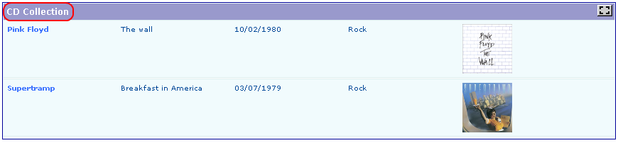
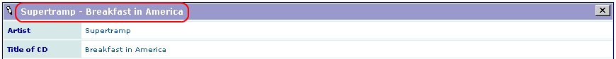
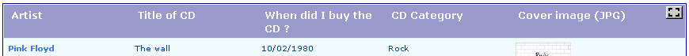
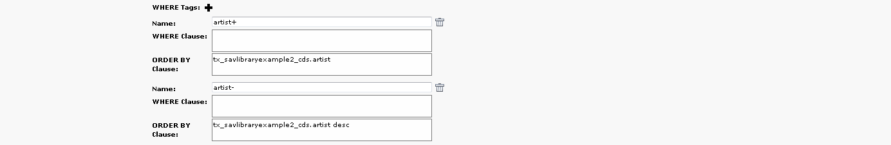
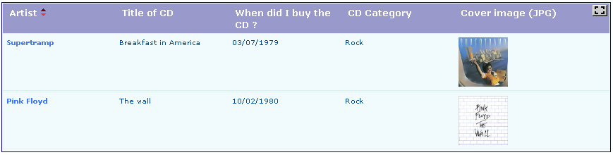
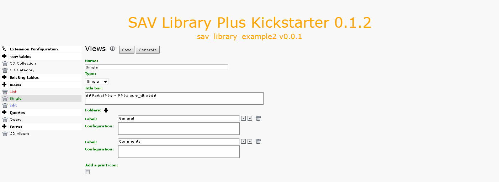
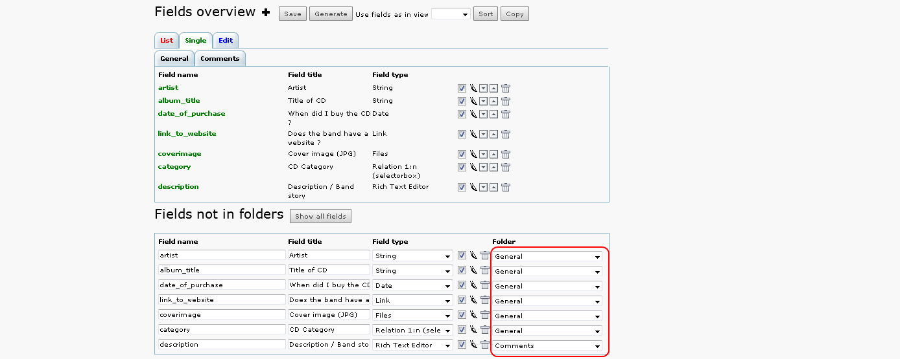
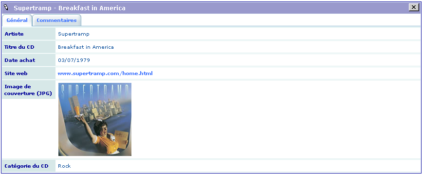
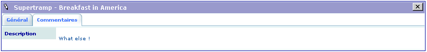

.. include:: ../../Includes.txt

.. _tutorial2_howTo:

=======
How to?
=======

How to Display a Title in the Upper Icon Bar of the View?
=========================================================

A title can be associated with each view. It is defined in the ``Title
bar`` section of the views. Text, language markers or field markers can
be used.

For example, if you use ``$$$formTitle$$$`` in the ``Title bar`` field,
this language marker will be replaced by its definition in the
``locallang.xlf`` file. In this example, ``formTitle`` is defined as ``CD
Collection`` for the default language and ``Liste de CD`` for the French
language. Therefore, the output becomes:

Now, if you use ``###artist### - ###album_title###`` in the ``Title bar``
section of the ``Single`` and ``Edit`` views, the markers ``###artist###``
and ``###album_title###`` will be replaced by the respective values of
the field ``artist`` and ``album_title`` for the current record. If these
markers are used in the ``Title bar`` section of the ``List`` view, they
will be replaced by the label associated with the fields. Thus, the
output is the following for the ``Single`` view:

How to Display the Labels Associated With Each Field in the Title Bar?
======================================================================

As explain above, field markers used in ``List`` view are replaced by
the label associated with the fields. Therefore, if the ``Title bar``
section is the following:

::

   <ul>
      <li class="artist">###artist###</li>
      <li class="title">###album_title###</li>
      <li class="date">###date_of_purchase###</li>
      <li class="category">###category###</li>
      <li class="image">###coverimage###</li>
   </ul>

The title bar becomes:

How to Change the Order of the Item List by Clicking on the Label in the Title Bar?
===================================================================================

For example, assume that we want to change the displayed order by
clicking on ``Artist`` (or ``Artiste`` if you use the french language).

- Add the following configuration parameter in the ``artist`` field of the
  ``List`` view.

::

   orderLinkInTitle = 1;

- Add the following configuration in the ``WHERE Tags`` section of your
  query. Click on the ``plus`` icon to add an entry.

In this configuration, use ``filedname+`` or ``fieldname-`` and associate
the order clause you want. In general ``+`` can be used for the
ascending order and ``-`` for the descending order.

By default, the displayed link will behave as a toogle between the
ascending and the descending sort. However you can control the display
using the property 
:ref:`orderLinkInTitleSetup <savlibrarykickstarter:general.orderLinkInTitleSetup>` 
which introduces links
associated with icons. For example, using ``orderLinkInTitleSetup =
:value:ascdesc;`` or ``orderLinkInTitleSetup = asc:value:desc;`` will
respectively provide the following outputs:

Of course, you may keep the toggle link by writing
respectively ``orderLinkInTitleSetup = :link:ascdesc;`` or
``orderLinkInTitleSetup = asc:link:desc;``.

The icon color will change depending on the sort order as shown below.
In the following caption, the descending order is displayed.

How to Reorganize the Fields with Folders?
==========================================

Folders may be introduced in the ``Single`` and ``Edit`` views to provide
a better organization of the information. Click on the ``plus`` icon to
add a folder.

In this example, two folders are defined. If the labels ``General`` and
``Comments`` are defined in the ``locallang.xlf`` file, they will be
replaced by their definition in the selected language, otherwise they
are used as it. Then, set a folder to each selected field of the ``CD
Collection`` table for the ``Single`` view as shown below, save and
generate the extension:

If you set all the fields to the folder ``General`` except the field
``description`` which is set to ``Comments``, the following views are
obtained in the frontend where the folder ``General`` and ``Comments`` 
have a French translation in ``locallang.xlf``.

