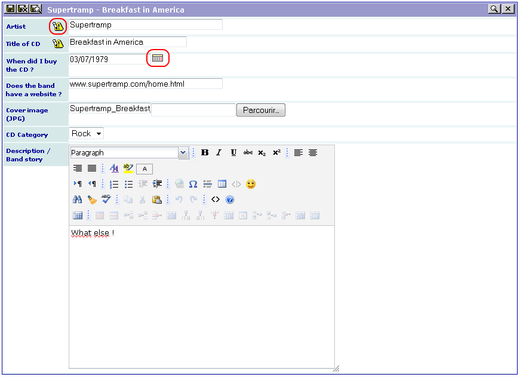

.. ==================================================
.. FOR YOUR INFORMATION
.. --------------------------------------------------
.. -*- coding: utf-8 -*- with BOM.

.. ==================================================
.. DEFINE SOME TEXTROLES
.. --------------------------------------------------
.. role::   underline
.. role::   typoscript(code)
.. role::   ts(typoscript)
   :class:  typoscript
.. role::   php(code)

Using the extension
-------------------

Create a page and insert a plugin content element and select “CD
Collection” in the plugin selector.

The configuration of the plugin is performed by means of a flexform
which comes with default values. Just select your form name, that is
“CD Album” in the “Select form” selector, save your content element
and  **clear the cache** .

**Add your CD categories in the Back End** (in list mode, create on or
several “CD Category” records: Rock, Jazz, Pop...).

Finally, go to your page in Front End and add items to your
collection.

As it can be seen, a new icon is associated with the fields “artist”
and “album\_title”. It indicates that these fields are required (if
you have selected “Required” as shown in the video, of course!). You
will not be able to save your record if you do not fill these fields
and an error message will be displayed.

Let us note that you can also mark any field as required using the
configuration parameter:

::

   required = 1;

You can use a date picker by clicking on the button associated with a
date.

The icons displayed for the RTE depend on the Front End configuration
of the RTE.

