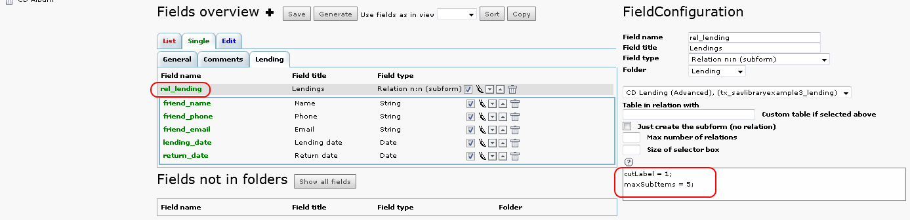
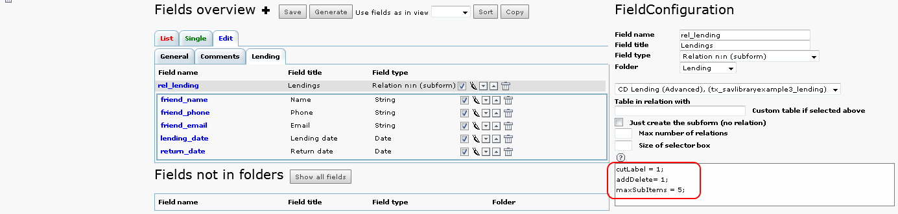
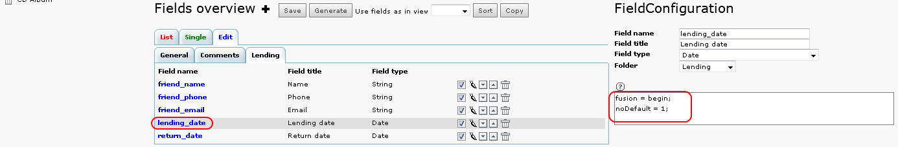
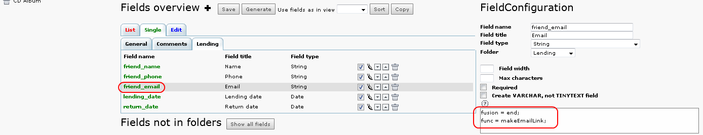
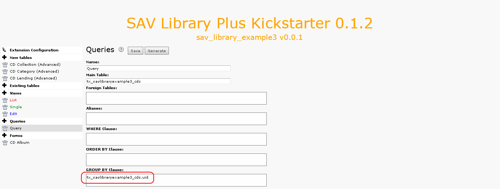

.. ==================================================
.. FOR YOUR INFORMATION
.. --------------------------------------------------
.. -*- coding: utf-8 -*- with BOM.

.. ==================================================
.. DEFINE SOME TEXTROLES
.. --------------------------------------------------
.. role::   underline
.. role::   typoscript(code)
.. role::   ts(typoscript)
   :class:  typoscript
.. role::   php(code)

Extension overview
------------------

MM table
^^^^^^^^

Now, let us assume that you want to lend your CD to your friends.
Well, even with friends it is useful to keep trace of your CD! One
solution is to build a new table which will be in a MM-relation with
your main table. One CD can have been borrowed by several friends.

In this table “tx\_savlibraryexample3\_lending”, the name of each
friend is kept as well as its phone number, its email, the lending
date and the return date. All the lending operation will be displayed
in a folder “Lendings” (which is “Prêts” in French).

A field “rel\_lending” was created by means of the SAV Library
Kickstarter in the “tx\_savlibraryexample3\_cds” as a relation n:n
with the table “tx\_savlibraryexample3\_lending”.

- “cutLabel = 1;” means that the label of this field will not be
  displayed (it is just a personal choice !)

- “maxSubItems = 5;” overrides the “Max number of relations” value (it
  is also a personal choice !)

In the “Edit” view, almost the same configuration is used. The
attribute “addDelete” will add a delete icon in front of each item in
the sub-form so that you can delete them.

Let us recall that the Context Sensitive Help provides information on
the attributes that can be used. In following captions, three
different attributes are used:

- “noDefault = 1;” is an attribute for “Date” type fields. It means that
  no default value, i.e. the current date, will be displayed when a new
  item is created.

- “fusion = begin;” and “fusion = end;” are “General” attributes which
  can be used almost with every fields. “fusion = begin;” starts the
  process of writing fields consequently on the same line, while “fusion
  = end;” stops the process.

- func = makeEmailLink;” belongs to “Functions” attributes, they can
  also be used almost with every fields for which it makes sense to
  apply thy function. It will generate an email link the current value
  of the field.

Queries
^^^^^^^

A “Group clause” is needed in the “Query” to display only one item per
CD in the list view. If this clause is not added, we get as many
repeated outputs for same item as the number of sub-items associated
with it (the reason is that “sav\_library\_plus” extension generates
left join relations between the tables).

