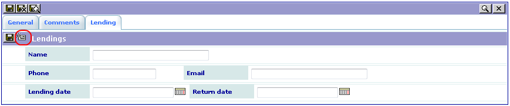
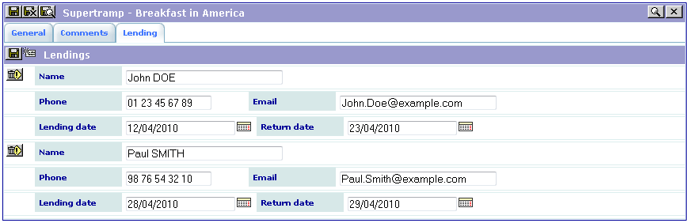
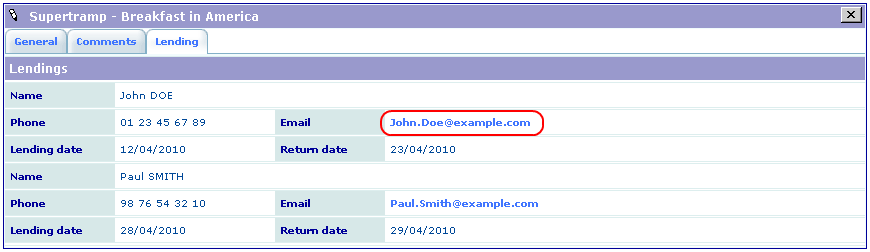

.. ==================================================
.. FOR YOUR INFORMATION
.. --------------------------------------------------
.. -*- coding: utf-8 -*- with BOM.

.. ==================================================
.. DEFINE SOME TEXTROLES
.. --------------------------------------------------
.. role::   underline
.. role::   typoscript(code)
.. role::   ts(typoscript)
   :class:  typoscript
.. role::   php(code)

Using the extension
-------------------

Proceed as in Tutorial 2 and go in The Front End to enjoy editing and
displaying you “Lendings”.

Click on the Icon to edit a new item. Fill it and save.

Click on the link to open your mail tool.

How to go further
^^^^^^^^^^^^^^^^^

Use the Context Sensitive Help and feel free to test the attributes in
the SAV Library Kickstarter.

