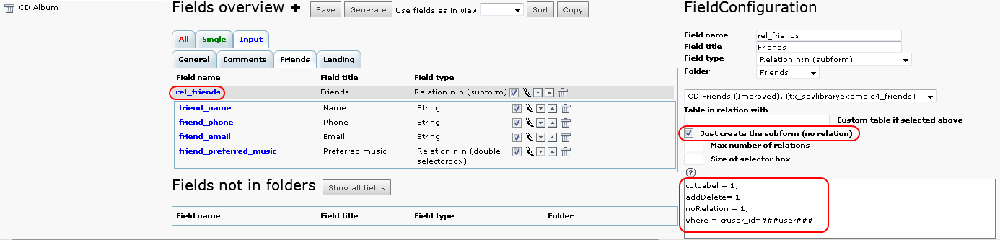
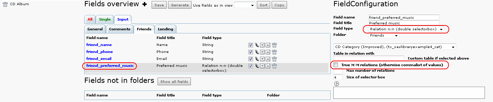

.. include:: ../../Includes.txt

.. _tutorial4_extensionOverview:

==================
Extension Overview
==================

New Relations
=============

A new table **tx_savlibraryexample4_friends** was created with four
fields: **friend_name**, **friend_phone**, **friend_email** as string
inputs and **friend_preferred_music** as a database relation. In this
example, it is clear that your friends are not associated with one CD.
They should be in the table but with no relation with the CD item. We
need a new **input** in the table **tx_savlibraryexample4_cds**, such
that you will be able to add your friends in an element browser as
shown in Example 3, **but without creating a relation field in the
table** .

This is done by selecting **Just create the Element Browser (no
relation)** as shown in the caption below.

As we want to select only our friends, a where clause is added to the
field which will select the records. They must have the correct
**cruser_id** in the **tx_savlibraryexample4_friends** table.

Let us assume that we want to select our friend's preferred music
styles from a double-window selector. Since our friends may have
several preferred styles, we have to build a MM relation. In this
example, we have chosen to use a non-true MM relation, that is no MM
table is built and, instead, TYPO3 uses a comma-separated list. If you
prefer to use a true MM relation just select the checkbox.

