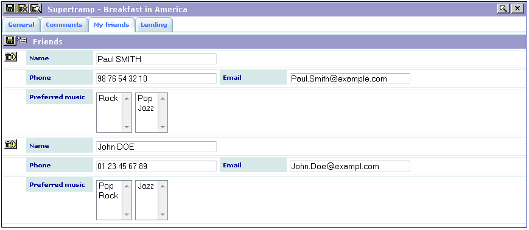
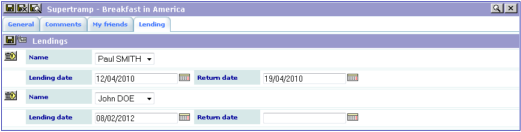

.. ==================================================
.. FOR YOUR INFORMATION
.. --------------------------------------------------
.. -*- coding: utf-8 -*- with BOM.

.. ==================================================
.. DEFINE SOME TEXTROLES
.. --------------------------------------------------
.. role::   underline
.. role::   typoscript(code)
.. role::   ts(typoscript)
   :class:  typoscript
.. role::   php(code)

Using the extension
-------------------

Add your friends. In the double-window selector, double-click on the
items to make them go from one window to the other. The left hand side
defines what is saved in the table.

Finally, input the lendings of your CDs.

