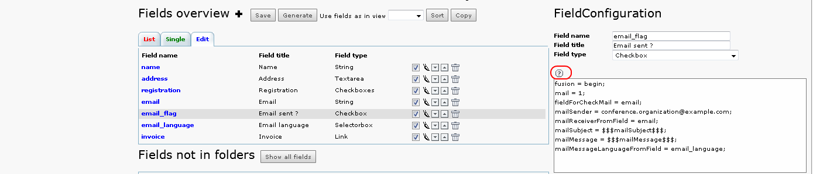

.. ==================================================
.. FOR YOUR INFORMATION
.. --------------------------------------------------
.. -*- coding: utf-8 -*- with BOM.

.. ==================================================
.. DEFINE SOME TEXTROLES
.. --------------------------------------------------
.. role::   underline
.. role::   typoscript(code)
.. role::   ts(typoscript)
   :class:  typoscript
.. role::   php(code)

Configuration
-------------

Open the extension in the SAV Library Kickstarter and select “SAV
Example6 – Email and RTF” in the “New Database Tables”, then select
the “Input” folder. As it can be seen, only the fields “email\_flag”,
“email\_language” and “invoice” have special configurations.

Field “email\_flag”
^^^^^^^^^^^^^^^^^^^

The field “email\_flag” is associated with the email generation. Let
us analyze its configuration shown below. Do not forget to use the
Context Sensitive Help to get information about the field type
attributes and to click on the “sav\_library\_plus / general”
attributes.

- “fusion = begin;”. This attribute is used with “fusion = end;” in the
  field “email\_language” to have both fields aligned.

- “mail = 1;”. It tells that an email is associated with the field.

- “fieldForCheckMail = email;”. The email will be sent only if the field
  “email” is not null.

- “mailSender = `conference.organization@provider.com
  <mailto:yolf.typo3@orange.fr>`_ ;”. This attribute defines the email
  sender. You can change it with your email and remove the line you have
  added in the TSconfig of the page.

- “mailSubject = $$$mailSubject$$$;”. It defines the mail subject. Since
  $$$tag$$$ is used, it means that localization is used. Therefore, the
  mail subject is defined in the file “locallang.xml” in the extension
  directory “pi1”. Open this file in your favorite editor and check the
  xml tag “<label index="mailSubject">”.

- “mailMessage = $$$mailMessage$$$;”. This attribute is the same as the
  previous one for the message to be sent. As you can check in the file
  “locallang.xml”, the xml tag “<label index="mailMessage">” contains
  ###fieldName### markers that were replaced by their values in the
  received message.

- “mailMessageLanguageFromField = email\_language;”. This attribute
  indicates that the language for the mail is provided by the value of
  the field “email\_language”.

This is one of the possibilities for sending emails. See the Context
Sensitive Help to see how to send emails each time you save the form
(mailAlways) or when data have changed (mailAuto).

Field “email\_language”
^^^^^^^^^^^^^^^^^^^^^^^

Nothing special about this field. It contains only:

- “fusion = end;”. It closes the fusion, thus the next field will be on
  the next line.

Field “invoice”
^^^^^^^^^^^^^^^

This field is used to generate the RTF file. It configuration is:

- “generateRTF = 1;”. It tells that RTF should be generated.

- “templateRTF = fileadmin/invoice.rtf;”. It defines the template file
  for the generation. This file contains markers
  ###tableName.fieldName### that will be replaced by their value for the
  current row.

- “saveFileRTF = fileadmin/###tx\_savlibraryexample6.name###.rtf;”. This
  attribute defines the name under which the RTF file will be saved.
  Since a marker is used in this attribute, it will be replaced by its
  value for the current row. In this example, the value of the field
  “name” is “Yolf”, therefore, the file name will be “Yolf.rtf”.

