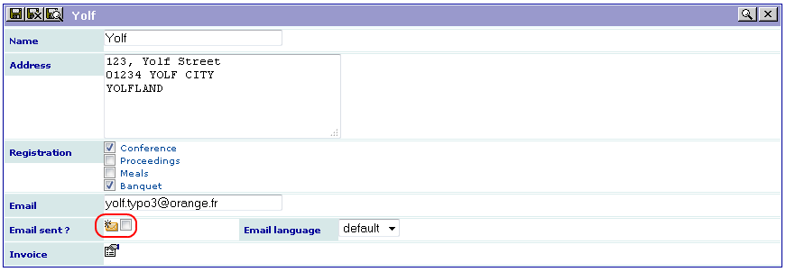
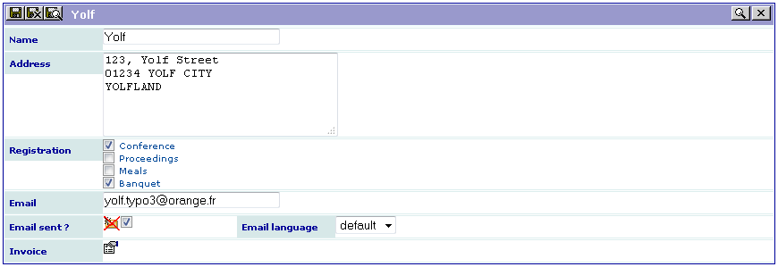
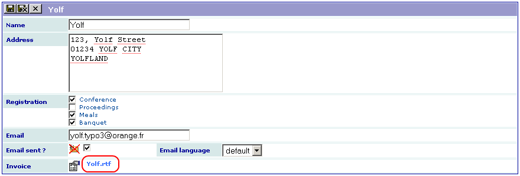

.. ==================================================
.. FOR YOUR INFORMATION
.. --------------------------------------------------
.. -*- coding: utf-8 -*- with BOM.

.. ==================================================
.. DEFINE SOME TEXTROLES
.. --------------------------------------------------
.. role::   underline
.. role::   typoscript(code)
.. role::   ts(typoscript)
   :class:  typoscript
.. role::   php(code)

Extension overview
------------------

Installation
^^^^^^^^^^^^

Download this example from the TER (sav\_library\_example6).

#. Install the extension,

#. Copy the file “invoice.rtf”, which is in the extension directory, in
   the “fileadmin” directory,

#. **Add the following line in the field TSconfig of the page where you
   have installed the extension:**
   *tx\_savlibraryexample6.View1.editView.fields.email\_flag.mailSender
   =* ` *your\_email@your\_provider* It
   will overload the email sender defined in the extension as it will be
   described in the configuration section.

Using the extension
^^^^^^^^^^^^^^^^^^^

Use the input form to enter a conference participant as in the
following caption.

Then select the email language (default or French) and click on the
email icon. If the email is correct, the form will slightly change as
shown below. You cannot click on the email icon anymore (if you need
to re-send the email, cancel the checkbox at the right hand side of
the email icon and save the form).

You should have received an email as the one below:

::

   Dear Yolf,

   Thank you for your registration to the conference.

   Your registration includes:

   √ Conference

   - Proceedings

   - Meals

   √ Banquet

   Your invoice will be available at the registration desk.

   Looking forwards to seeing you.

   Best regards,

   The conference organization committee.

To generate the RTF file, click on the icon associated with the
invoice, then open the generated file by clicking on the link and
print it (the fields are automatically updated).

