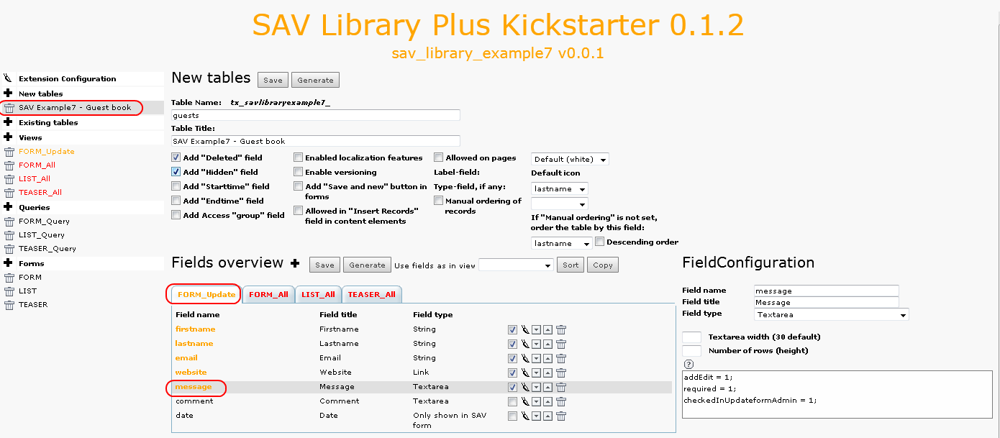
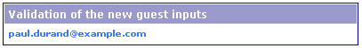

.. ==================================================
.. FOR YOUR INFORMATION
.. --------------------------------------------------
.. -*- coding: utf-8 -*- with BOM.

.. ==================================================
.. DEFINE SOME TEXTROLES
.. --------------------------------------------------
.. role::   underline
.. role::   typoscript(code)
.. role::   ts(typoscript)
   :class:  typoscript
.. role::   php(code)

Extension overview
------------------

Edit the extension “sav\_library\_example7” in the SAV Library
Kickstarter to get an overview. It contains:

- Three forms (FORM, LIST, TEASER),
- Four views (FORM\_update, FORM\_All, LIST\_All, TEASER\_All),
- Three queries (FORM\_Query, LIST\_Query, TEASER\_Query).

The guest input form (FORM)
^^^^^^^^^^^^^^^^^^^^^^^^^^^

Click on “FORM” in the “Forms” section. As you can see, the form has a
list view, a special view and a query.

The special view, named “FORM\_Update” is used to generate the guest
input form. The list view is used to validate the data in the
administration mode. Now, let us analyze each view.

The view FORM\_Update
^^^^^^^^^^^^^^^^^^^^^

Click on “FORM\_Update” in the “Form views” section.

The view is of type “Special” and of sub-type “Form view”. The “Item
template” field defines the template. In our case, two 
 are used
for having two columns in the form. The SAV Library provides some help
to easily implement the view. $$$label[fiedname]$$$ will be replaced
by the field title, depending on the localization, while
###field[fieldname]### will be replaced by the input item associated
with the type of the field. The CSS classes “field” and “label” are
defined in the default CSS of the SAV Library Plus extension. You may
overload their properties in your CSS file. Finally,
###button[submit]### creates the submit button.

Now, we will analyse the configuration. Click on “SAV Example7 – Guest
book” in the section “New tables”, select the “FORM\_Update” folder
tab and click on “message”, for example.

As it can be seen, the configuration is simple since only three
attributes are used:

- “addEdit = 1;” means that the field can be edited by the guest, that
  is it will be displayed in the edit mode for the defined type. For the
  above example, a textarea is displayed.
- “required = 1;” means that the guest will have to fill the field.
- “checkedInUpdateformAdmin = 1;” means that the field will be pre-
  checked for the validation in the Admin form as explained in the next
  section.

For example, with the above configuration and the provided CSS file,
once installed, you should have the following result. Required fields
appear with the “\*” character.

And, thanks to the localization markers $$$label[fieldname]$$$, if you
change to the French language, you will get:

The view FORM\_All
^^^^^^^^^^^^^^^^^^

When a “Form view” is used, information provided by the guest are not
directly saved in the table fields. A temporary field, named
“\_submitted\_data\_” is automatically added to the table. It used to
keep the guest inputs until you have validated them. For that, the
“Form view” includes an “Admin” mode in which you have to enter by
means of an associated “List” view which will display the new inputs.
Since we will use a filter which requests the email of the guest
input, it will be used in the view to switch to the “Admin” mode.

Localization marker $$$adminTitle$$$ is used to the view title bar.
Let us recall that the marker is defined in the file locallang.xml in
the “Resources/Private/Language” directory of the extension. The
template is very simple and contains only the email field which is
selected in the configuration.

Two attributes are associated with the field “email”:

- “func = makeItemlink;”, already seen in the previous examples, which
  creates the link associated to the field value.
- “updateForm = 1;” specifies that the updateform should be opened.

Once  **correctly** installed, if a guest, e.g. “
`paul.durand@example.com <mailto:paul.durand@example.com>`_ ” has left
a new message, you should have the following output:

Now, by clicking on the link, you will enter in the “Admin” mode. As
can be seen, the fields have a checkbox already checked. It is due to
the property “checkedInUpdateformAdmin = 1;” set in the “Update view”.
Only fields that are checked will be transferred to their respective
place in the table when submitting the form.

.. figure:: ../../Images/Tutorial7GuestValidationEditView.png
 
The query FORM\_Query
^^^^^^^^^^^^^^^^^^^^^

In order to get only the guest inputs that have not been checked and
processed, a special WHERE clause has to be used.

As explained before, the guest entry is not directly saved in the
table fields. Information are serialized and temporary saved in the
field “\_submitted\_data\_”. Therefore, to check that new entries are
present, the WHERE clause checks a substring in the
“\_submitted\_data\_” field. The substring is: extensionName\_formName
**in lower case** . When data are processed, the field '\_validated\_”
is automatically set. Thus, the WHERE clause will return new entries
that have not been processed.

In our example, the extensionName is “sav\_library\_example7” and the
formName is “FORM”, thus the substring to fetch is:
“sav\_library\_example7\_form”.

The guest input list (LIST)
^^^^^^^^^^^^^^^^^^^^^^^^^^^

Nothing very special here. The form LIST includes a conventional “show
All” view. Analyze the view, the query and the field configurations
(use the Context Sensitive Help if necessary). Below are two useful
comments.

Field “comment”
"""""""""""""""

::

   “addLeftIfNotNull = <strong>$$$label[comment]$$$</strong> ;”
   cutIfNull = 1;

These two properties make is possible to display the label for the
field only if the field is not null (addLeftIfNotNull will add the
right hand side string to the left of the content if it is not null).
The field content is cut if it is null (cutIfNull).

Field “date”
""""""""""""

This field has a special type “0nly shown in SAV form”. It means that
it will not be present in the table but you may use it as marker
###date### in forms. It has one attribute:

- “alias = crdate;” means that this field is an alias for the field
  “crdate” that already exists in the table (it is created by the
  Kickstarter).

Below is the screen shot obtained for the LIST form when the extension
is correctly installed.

.. figure:: ../../Images/Tutorial7ListView.png

The teaser (TEASER)
^^^^^^^^^^^^^^^^^^^

The form “TEASER” includes a conventional “show All” view. Analyze the
view, the query and the field configurations (use the Context
Sensitive Help if necessary). The only specific configuration concerns
the field “message”. We want to have it cropped to 60 characters and
have a more link right to the text to go to the page where the “LIST”
form is.

- “stdWrapValue =crop = 60\|...;” defines a conventional TS stdWrap
  property. You can add here full TS syntax. Do not forget that the
  configuration field is ended by a semi-column, therefore if you need a
  semi-column in your TS, write it “\;”.

- “addRightIfNotNull = $$$more$$$;” adds the label to the right hand
  site of the content if it is not null. The localization marker
  $$$more$$$ is used and will be replaced by its value in
  “pi1/locallang.xml”.

- “funcRight = makeLink;” applies the internal function “makeLink”,
  which creates an internal link, to the right hand side part, that is
  to the more link.

- “setUidRight = 123;” defines the page uid associated with the link.
  The value 123 is just for example, you can either replace it by your
  page uid or overload it using the TS pageConfig as explained in the
  configuration section “Changing the field configuration ”.

If the extension is correctly installed, you should get:

