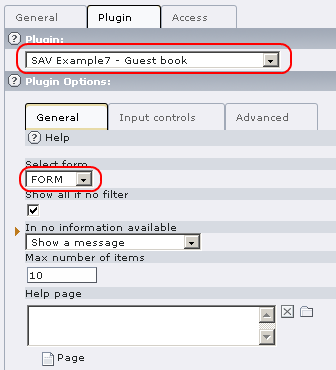
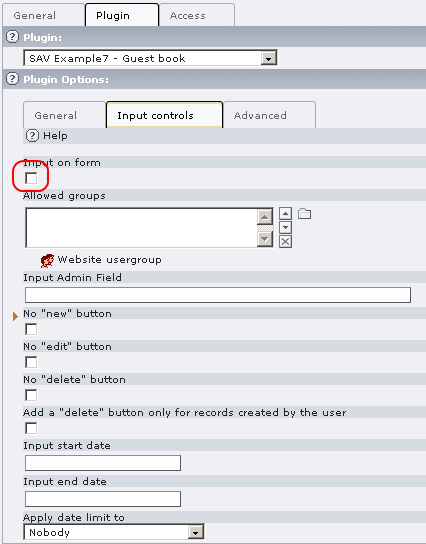
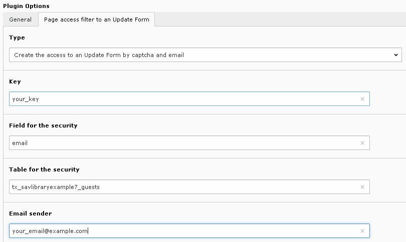
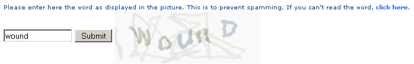
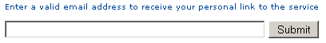
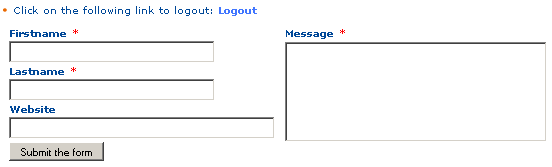
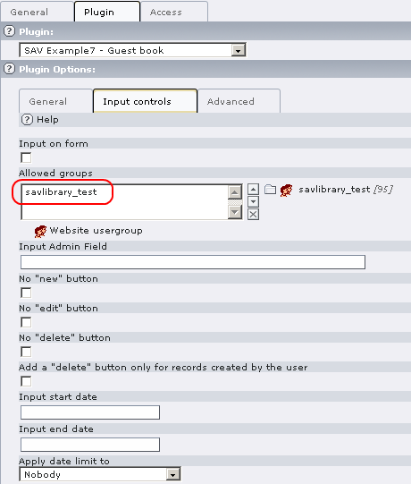
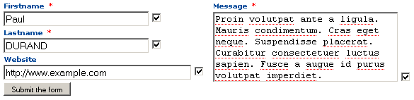

.. ==================================================
.. FOR YOUR INFORMATION
.. --------------------------------------------------
.. -*- coding: utf-8 -*- with BOM.

.. ==================================================
.. DEFINE SOME TEXTROLES
.. --------------------------------------------------
.. role::   underline
.. role::   typoscript(code)
.. role::   ts(typoscript)
   :class:  typoscript
.. role::   php(code)

Installation and configuration
------------------------------

Installation
^^^^^^^^^^^^

#. Download the extension “sav\_library\_example7” from the TER and
   install it.

#. Download the extension “sav\_filter\_pageaccess” from the TER and
   install it.

#. Download the extension “sr\_freecap” from the TER and install it.

Guest input
^^^^^^^^^^^

-  Create a page for the guest input.

-  In this page, insert a plugin content. Select “SAV Example7 – Guest
   book”, select “FORM” in the “General” folder, then in the “Input
   Controls” folder, uncheck “input on form”.

-  In the same page,  **before the previous plugin (see below)** , add a
   new plugin content. Select “SAV Filter Page Access”. Read the Context
   Sensitive Help by clicking on the icon. You may also read the
   documentation associated with this extension. Fill the fields as shown
   below. Replace `your\_email@example.com
   <mailto:your_email@example.com>`_ by a  **valid email** . The value in
   “Uid for the field cruser\_id” will be the default value for the
   “cruser\_id” field of each record in the table
   “tx\_savlibrary\_example7\_guests”. For example, put your FE user uid.
   Provide a key which will be used to crypt the link. Finally provide a
   redirection page for errors ( **this field is required** ). When using
   captcha, you can set this field with the current page.

.. figure:: ../../Images/Tutorial7PageContent.png

-  Save and go to the page in the Front End. Answer to the captcha and
   submit.

-  Fill the field with your email and submit.

-  An information message is displayed and you should received an email
   with a personal link.

::

   Click on the following link to access to the service
   Guest input
   This link is valid only for one request. 

The link is “Your\_page\_title” (“Guest input” is the page title used
for the tutorial). Click on the link to access to the input form, fill
the form and submit it.

 
Guest input validation
^^^^^^^^^^^^^^^^^^^^^^

-  Create a FE group, for example “savlibrary\_test”. It will be use to
   protect the page and define the “Admin” group. Apply this group to
   you, that is to your FE user record.

-  Create a page for the guest input validation. Protect the page with
   the FE group.

-  Insert a plugin content. Select “SAV Example7 – Guest book”, select
   “FORM” in the “General” folder. In the “Input Controls” folder,
   uncheck “input on form” and add the FE Group to the “Allowed groups”
   field.

-  Save and go to the page in the Front End and click on the email
   associated with your last input.

List view
^^^^^^^^^

-  Insert a plugin content. Select “SAV Example7 – Guest book”, select
   “LIST” in the “General” folder. Set the field “Max number of items” to
   the number of items you want in the list (10 is the default). Uncheck
   “input on form” in the “Input Controls” folder. Save and go to the
   page in the Front End.

Teaser view
^^^^^^^^^^^

-  Insert a plugin content. Select “SAV Example7 – Guest book”, select
   “TEASER” in the “General” folder. Set the field “Max number of items”
   to the number of items you want in the teaser. Uncheck “input on form”
   in the “Input Controls” folder.

-  If you have not changed the value of “setUidRight” as explained in
   5.7.5, edit the page property. In the page TSConfig
   add:tx\_savlibraryexample7.TEASER.listView.fields.message.setUidRight
   =  *uid\_of\_the\_page\_containing\_the\_list\_form*

-  Go to the page in the Front End.

