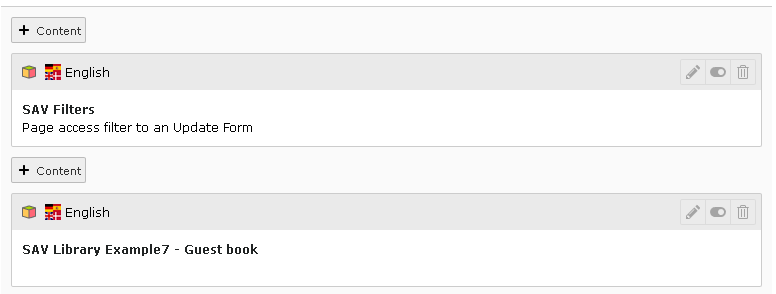

.. include:: ../../Includes.txt

.. _tutorial7_installationAndConfiguration:

==============================
Installation and Configuration
==============================

Installation
============

#. Download the extension `sav_library_example7 
   <https://extensions.typo3.org/extension/sav_library_example7>`_ 
   from the TER and install it.

#. Download the extension `sav_filters 
   <https://extensions.typo3.org/extension/sav_filters>`_ from the TER and
   install it.

#. Download the extension `sr_freecap 
   <https://extensions.typo3.org/extension/sr_freecap>`_ 
   from the TER and install it.

Guest Input
===========

-  Create a page for the guest input.

-  In this page, insert a plugin content. Select **SAV Example7 – Guest
   book**, select **FORM** in the **General** folder, then in the **Input
   Controls** folder, uncheck **input on form**.

-  In the same page,  **before the previous plugin** , add a
   new plugin content. Select **SAV Filters**. Fill the fields as shown
   below. Replace **your_email@example.com** by a  valid email. The value in
   **Uid for the field cruser_id** will be the default value for the
   **cruser_id** field of each record in the table
   **tx_savlibrary_example7_guests**. For example, put your frontend user uid.
   Provide a key which will be used to crypt the link. Finally provide a
   redirection page for errors ( **this field is required** ). When using
   captcha, you can set this field with the current page.

-  Save and go to the page in the frontend. Answer to the captcha and
   submit.

-  Fill the field with your email and submit.

-  An information message is displayed and you should received an email
   with a personal link.

::

   Click on the following link to access to the service
   Guest input
   This link is valid only for one request. 

The link is **Your_page_title** (**Guest input** is the page title used
for the tutorial). Click on the link to access to the input form, fill
the form and submit it.

 
Guest Input Validation
======================

-  Create a frontend group, for example **savlibrary_test**. It will be use to
   protect the page and define the **Admin** group. Apply this group to
   you, that is to your frontend user record.

-  Create a page for the guest input validation. Protect the page with
   the frontend group.

-  Insert a plugin content. Select **SAV Example7 – Guest book**, select
   **FORM** in the **General** folder. In the **Input Controls** folder,
   uncheck **input on form** and add the frontend Group to the **Allowed groups**
   field.

.. figure:: ../../Images/Tutorial7GuestInputFlexform.png

-  Save and go to the page in the frontend and click on the email
   associated with your last input.

.. figure:: ../../Images/Tutorial7GuestValidationListView.png 

.. figure:: ../../Images/Tutorial7GuestValidationEditView.png 

List View
=========

-  Insert a plugin content. Select **SAV Example7 – Guest book**, select
   **LIST** in the **General** folder. Set the field **Max number of items** to
   the number of items you want in the list (10 is the default). Uncheck
   **input on form** in the **Input Controls** folder. Save and go to the
   page in the frontend.

Teaser View
===========

-  Insert a plugin content. Select **SAV Example7 – Guest book**, select
   **TEASER** in the **General** folder. Set the field **Max number of items**
   to the number of items you want in the teaser. Uncheck **input on form**
   in the **Input Controls** folder.

-  If you have not changed the value of **setUidRight**, edit the page property. 
   In the page TSConfig add:
   
   ::
   
      tx_savlibraryexample7.TEASER.listView.fields.message.setUidRight
      =  *uid_of_the_page_containing_the_list_form*

-  Go to the page in the frontend.