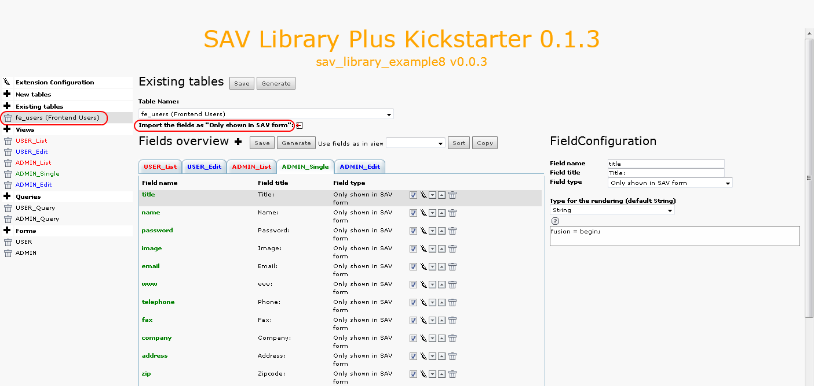
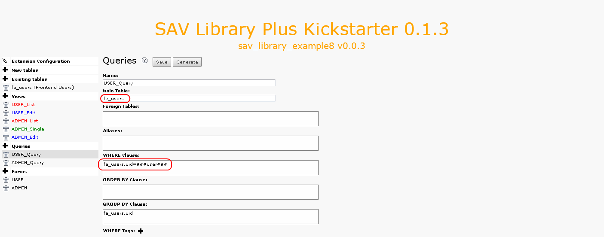
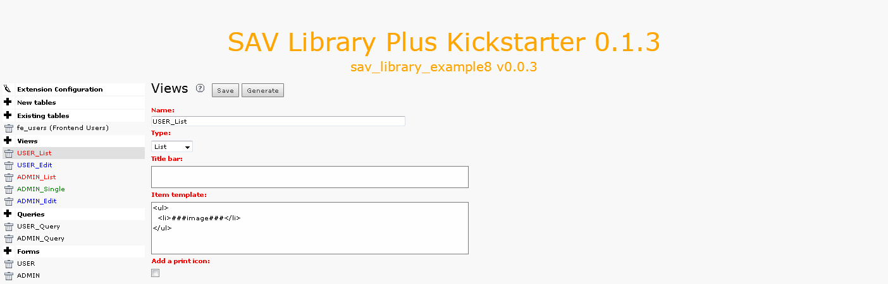
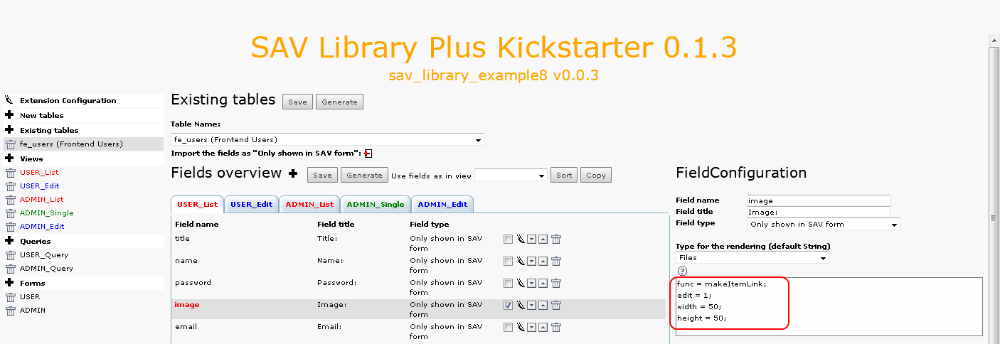

.. ==================================================
.. FOR YOUR INFORMATION
.. --------------------------------------------------
.. -*- coding: utf-8 -*- with BOM.

.. ==================================================
.. DEFINE SOME TEXTROLES
.. --------------------------------------------------
.. role::   underline
.. role::   typoscript(code)
.. role::   ts(typoscript)
   :class:  typoscript
.. role::   php(code)

Extension overview
------------------

Edit the extension “sav\_library\_example8” in the SAV Library
Kickstarter to get an overview. It contains:

- Two forms (USER, ADMIN),

- Five views (USER\_List, User\_Edit, ADMIN\_List, ADMIN\_Single,
  ADMIN\_Edit),

- Two queries (USER\_Query, ADMIN\_Query).

The organization of the forms is quite similar to the previous
examples. Just click on them to analyze it. Let us focus on the
configurations associated with the existing table “fe\_users” by
clicking on the link “fe\_users”. As it can be seen, all fields have
type “Only shown in SAV Form”.

When the extension was created, by clicking on the link  **Import
fields from table as “Only**  **shown in SAV form”** , all fields from
the table “fe\_users” were imported, then unwanted fields were
removed.

The user form (USER)
^^^^^^^^^^^^^^^^^^^^

In this example, it was chosen to design a very simple form consisting
in the display of the user image field. The image is associated with a
link to open the user form in the edit mode.

The query USER\_Query
"""""""""""""""""""""

The query is used to filter the “fe\_users” table with the
authenticated user. This is easily done by using the marker ###user###
in the WHERE clause of the query.

The views USER\_List and USER\_Edit
"""""""""""""""""""""""""""""""""""

The template associated with these views is quite simple since the
only field to display is “image”.

And to make it possible to generate the link to open the input view,
only a few configuration attributes are required.

- “func = makeItemLink;” generates the link for the current item.

- “edit = 1;” opens the edit view instead of the default view (“single”
  view).

- “width = 50;” and “height = 50;” define the size of the image.

Because there is no “Single” view associated with the user form, the
default “Edit” view title bar must be changed, in particular the “save
and show” and the “show button” must be removed. The example comes a
directory “Resources/Private/Partials” which contains two directories
“TitleBars” and “Footers”. They respectively contain a folder
“EditView” which contain themselves a new “default.html” Fluid file.
We will see later how to call these new “Partials”.

Finally, to override the default css, the example comes with a css
file (sav\_library\_example8.css) in the “Resources/Private/Styles”
directory which contains the following instructions :

::

   .sav_library_example8_user .savLibraryPlus .listView {width:62px;background-color:#ffffff;}
   .sav_library_example8_user .savLibraryPlus .listView .titleBar {display:none;}
   .sav_library_example8_user .savLibraryPlus .listView .items .item {border:none;background-color:#ffffff;}

Concerning the view USER\_edit, there is no specific configuration
that needs to be described here. Fields are selected and attributes
“fusion = begin;” and “fusion = end;” are used to group fields.

The administration form (ADMIN)
^^^^^^^^^^^^^^^^^^^^^^^^^^^^^^^

The administration form is used in the Front End to manage, give
rights, export FE users. It is based on a conventional query, “List”,
“Single” and “Edit” views for which no specific configuration is
needed. Just click on the different views and tabs to see how fields
are grouped.