.. ==================================================
.. FOR YOUR INFORMATION
.. --------------------------------------------------
.. -*- coding: utf-8 -*- with BOM.

.. ==================================================
.. DEFINE SOME TEXTROLES
.. --------------------------------------------------
.. role::   underline
.. role::   typoscript(code)
.. role::   ts(typoscript)
   :class:  typoscript
.. role::   php(code)

Installation and configuration
------------------------------

Installation
^^^^^^^^^^^^

The following installation is just an example for testing the
extension.

- Download the extension “sav\_library\_example8” from the TER and
  install it.
- Create a folder for the FE users.
- In the folder, create a FE group for regular users and a FE group for
  admin users.
- In the folder, create a regular user and an admin user for the test.

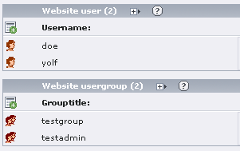

- Create a test page for the USER form and another for the ADMIN form.

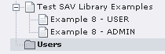

- In the USER page, insert the plugin and select the USER form.

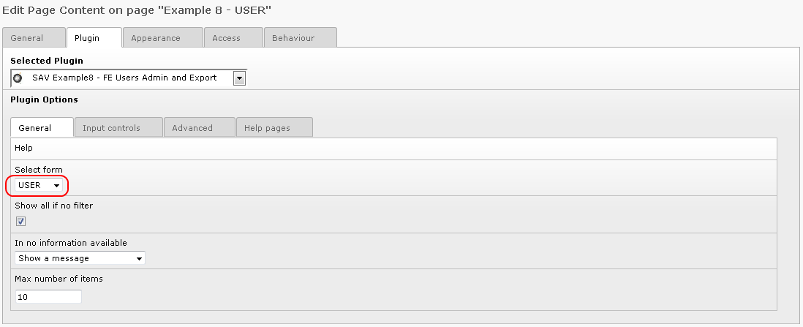

- Edit the Page Properties and add the following configuration
  TypoScript configuration in the folder “Resources”. It will change the
  “Partials” root path to the “Partials” directory provided with this
  extension.

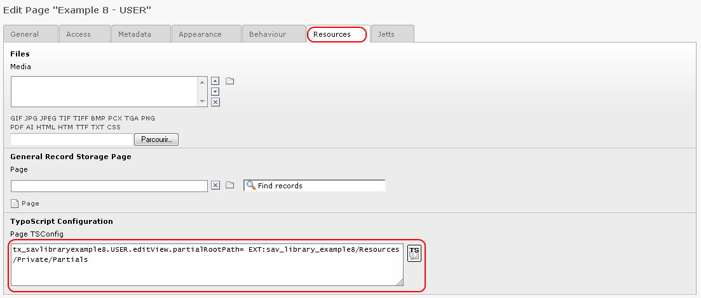

- Authenticate the user and go to the USER page. You should see either
  the user's image (here user\_defined.gif icon was used) or a question
  mark image if no input was provided.

.. figure:: ../../Images/Tutorial8UserIcon.png

- Click on the image link to open the edit view. As it can been seen,
  the new title bar has been taken into account and only “Save” and
  “Close” buttons are displayed.

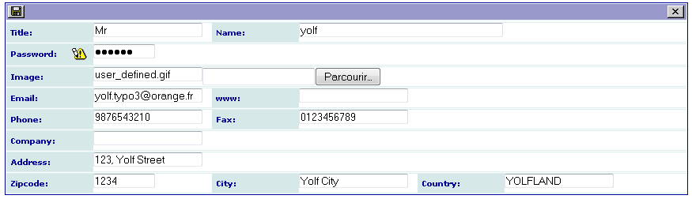

- In the ADMIN page, insert the plugin, select the ADMIN form and
  include the user folder in the “Record Storage Page” field.

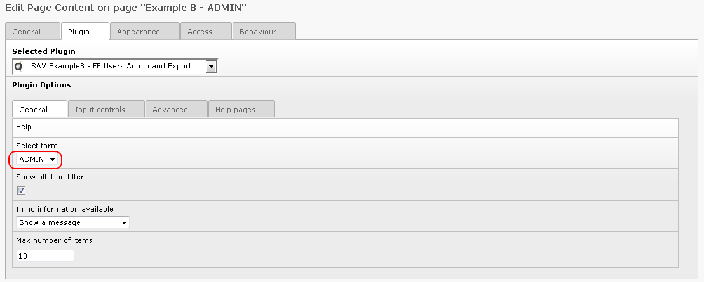

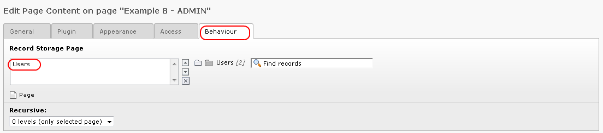

- Click on the folder “Input controls”. Select “Input on form” to allow
  the input. Add your administration group (here “admin”) in “Allowed
  group”. Select “No new button” if you do not want to allow the
  creation of new users.

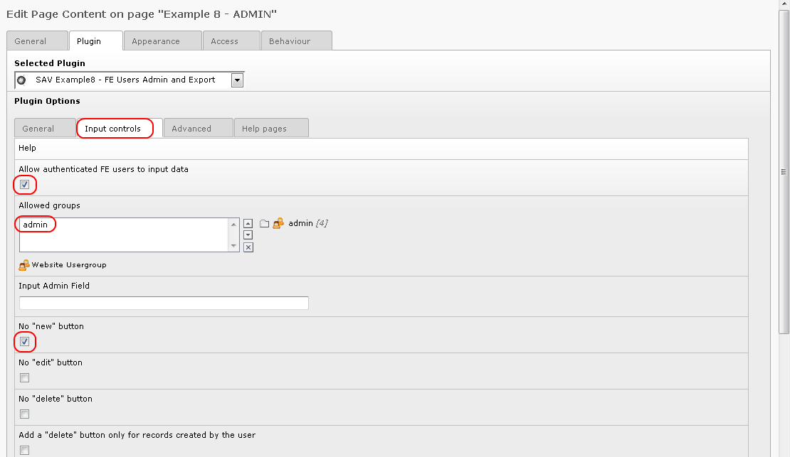

- Authenticate the administration user and go to the ADMIN page. The
  view displays the users'name, their email, their phone number and
  their groups. The behavior of the form is the same as in the previous
  examples. Click on the name to see the user's configuration. Use the
  edit icon to modify the fields.

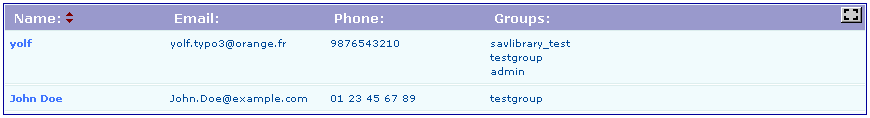

Exporting data to CSV format
^^^^^^^^^^^^^^^^^^^^^^^^^^^^

Exporting data is possible for any form built with the SAV Library
Generator. To allow this feature you simply have to add the following
line either  **in the user TS Config field or in a group TS Config** :

::

   sav_library_example8_Export = *

In general, it is done in the Back End. However, our extension makes
it possible to do it in the Front End for the user as shown below.

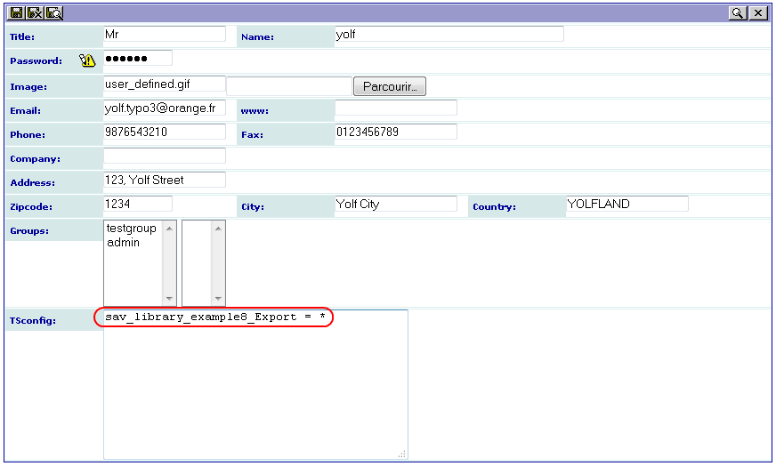

Now, close the view and verify that you obtain a new “CSV” icon in the
ADMIN “Show All” and click on it to obtain the export view.

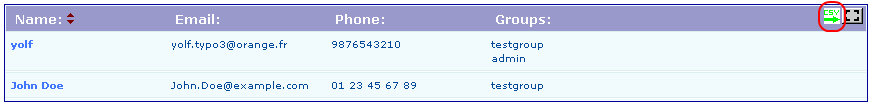

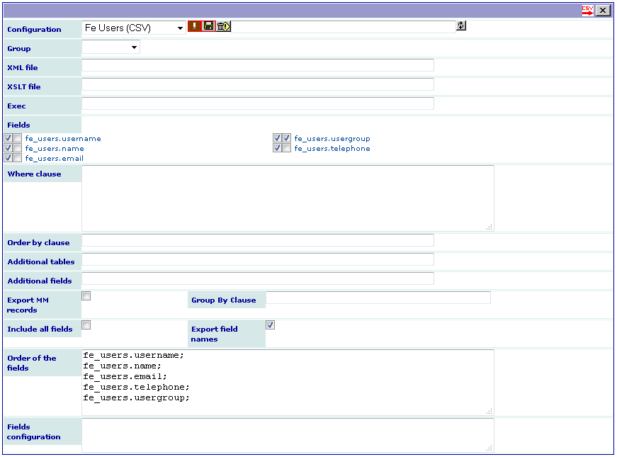

The configuration can be used to save, load, delete an export
configuration. Use the toogle button to display only selected fields
or to display all fields. In the above caption, the export
configuration “Fe Users (CSV)”, previously saved, was reloaded.

XML and XSLT files can be used to export data to other formats (see
next section).

Checkboxes are used to select the fields to be exported. If the first
checkbox is selected, the raw data are displayed, that is the content
of the field in the data base. If the second on is selected, a
rendering is done. The field is displayed as it would have been in a
Single view.

The “Where clause” field is used to filter the data to be exported.
Let us note that if you double-click on a field name, it will be added
in the “Where clause” field. It is useful to avoid mistakes.

The “Order clause” field is used to order the data to export.

“Additional tables” can be used for more complex export where you need
to link data used by the extension to data in other tables. In that
case do not forget to add a condition in the “Where clause” to join
correctly the tables.

“Export MM records” can be set when your extension use MM tables and
you want to export all data. In that case you may also need to add a
“Group by clause”.

“Include all fields” can be used when you want to export fields like
uid, pid, crdate, ... which are hidden by default. Click on the red
CSV icon to include all the fields. Use the toogle button if you have
previously restricted the display to selected fields.

“Export field names” can be selected when you want to have the field
names as the first line in the CSV file.

“Order of the fields” can be used to change the order in which the
fields are extracted. By default, it is the order in which the appear
in the checkbox list from left to right. In the above example, without
information in this field, “fe\_users.username” comes first, then
“fe\_users.usergroup” is extracted, then “fe\_users.name” and so on.
Provide a list of fields separated by a semi-column (one field per
line makes it simple to read) in the text area to change this order.
Let us also note that you can put the same field several time, which
is sometimes useful when you process directly the CSV file.

“Fileds configuration” can be used to add a configuration for the
field rendering. The syntax is the same as in the SAV Library
Kickstarter but each configuration must start by the full field name.
See after for an example.

Click on the red CSV icon to export your data. Below is the result
obtained when the CSV file is imported in LibreOffice Calc.

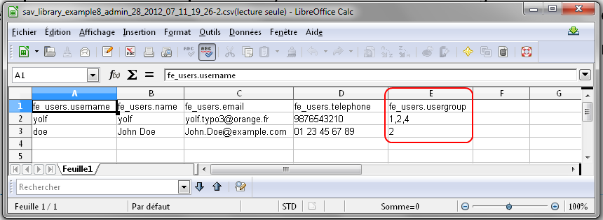

As it can be seen, the user groups are displayed as a comma-separated
list because the fields were exported in the raw mode. By selected,
the second checkbox, it is displayed with the same rendering as in a
single view.

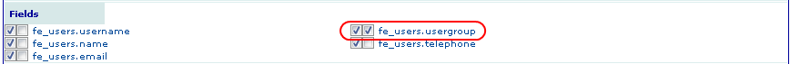

Depending on the field type, HTML tags can be exported, which is the
case with the usergroup field of the fe\_users table. If you want to
process these tags, use a stdWrapItem attribute for the field . For
example, to remove them, add the following configuration in “Fields
configuration” as shown below (see Changing the field configuration ).

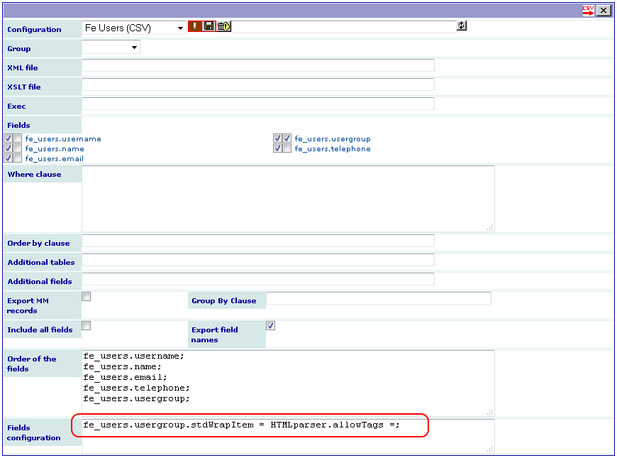

Exporting data to other formats
^^^^^^^^^^^^^^^^^^^^^^^^^^^^^^^

The exporting form contains two fields “XML file” and “XSLT file”
which enable the export to other formats.

The “XML file” field must be a XML file which will be used as a
template. It may contain:

- field markers under the conventional format in the SAV Library
  Extension Generator, that is ###field\_name###,

- localization markers under the conventional format in the SAV Library
  Extension Generator, that is $$$tag$$$ for a marker in the
  locallang.xml file, $$$label[field\_name]$$$ to obtain the label
  associated with a field,

- constant markers under the form $$$constant[tag]$$$ (e.g.
  $$$constant[PATH\_site]$$$).

The XML tag may contain special attributes:

- “sav\_type” can be set to:

#. “replaceAlways”: the XML tag and its children will be processed for
   all exported rows,

#. “replaceDistinct”: the XML tag and its children will be processed each
   time the associated “sav\_id” attribute changes in the rows,

#. “cutIfEmpty”: the XML tag and its children will be cut if the
   associated “sav\_id” attribute is empty in the row,

#. “cutIfNotEmpty”: the XML tag and its children will be cut if the
   associated “sav\_id” attribute is not empty in the row,

#. “cutIfEqual”, “cutIfNotEqual”, “cutIfgreater”, “cutIfLower”,
   “cutIfgreaterEqual”, “cutIfLessEqual”: the XML tag and its children
   will be cut if the associated “sav\_id” attribute in the row is
   respectively equal to, not equal to, greater than, less than, greater
   than or equal to, lower than or equal to, a given value provided by
   the “sav\_value” attribute.

- “sav\_id” must be a field name,

- “sav\_value” must be a value.

Let us illustrate this principle to generate a docbook article. If
your are not familiar with docbook, please read `http://www.oasis-
open.org/docbook/documentation/reference/html/docbook.html <http://www
.oasis-open.org/docbook/documentation/reference/html/docbook.html>`_
and `http://www.sagehill.net/docbookxsl/
<http://www.sagehill.net/docbookxsl/>`_ . The former is the docbook
definitive guide and the later the docbook xsl complete guide.

Assume that we want to produce the FE user list under the form of a
table with four columns: the user image, his/her name, email and
groups. It can be solved used the XML file “to\_docbook.xml”,
available in the “Resources/Private/Files” directory of this
extension. As it can be seen, this file uses several markers and
attributes.

.. code-block:: xml

   <?xml version="1.0" encoding="UTF-8"?>
   <!DOCTYPE article
     PUBLIC "-//OASIS//DTD DocBook XML V4.5//EN" "http://www.oasis-open.org/docbook/xml/4.5/docbookx.dtd">

   <article lang="en">
     <title>List of FE users</title>
     <informaltable>
       <tgroup cols="4" align="left" colsep="1" rowsep="1">
         <thead>
           <row>
             <entry align="center"></entry>
             <entry align="center">$$$label[fe_users.name]$$$</entry>
             <entry align="center">$$$label[fe_users.email]$$$</entry>
             <entry align="center">$$$label[fe_users.usergroup]$$$</entry>
           </row>
         </thead>
         <tbody>
           <row sav_type="replaceAlways">
             <entry align="center">
               <mediaobject sav_type="cutIfEmpty" sav_id="fe_users.image">
                 <imageobject>
                   <imagedata fileref="$$$constant[PATH_site]$$$uploads/pics/###fe_users.image###" width="2cm" scalefit="1" />
                 </imageobject>
               </mediaobject>
             </entry>
             <entry>###fe_users.name###</entry>
             <entry>###fe_users.email###</entry>
             <entry><itemizedlist spacing="compact">###fe_users.usergroup###</itemizedlist></entry>
           </row>
         </tbody>
       </tgroup>
     </informaltable>
   </article>

In order to produce the XML file, the process is the same as for the
CSV export. Each field marker have to be selected to be replaced and
the template file has to be provided in the “XML file” field as shown
in the following caption (the configuration was saved in “FE users
(docbook)”).

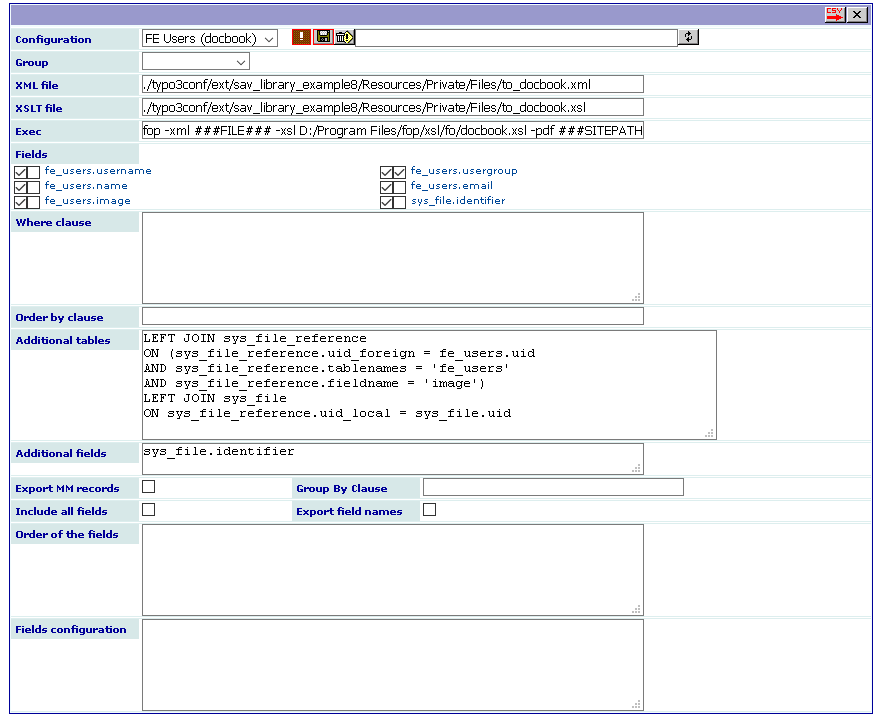

In this example, the document is processed automatically, by calling
for example the FOP docbook processor (
`http://xmlgraphics.apache.org/fop/
<http://xmlgraphics.apache.org/fop/>`_ ), in the extension. In order
to do so, an admin user must allow the use of the php exec function in
the “Advanced” folder of the configuration of the extension as shown
in the following caption.

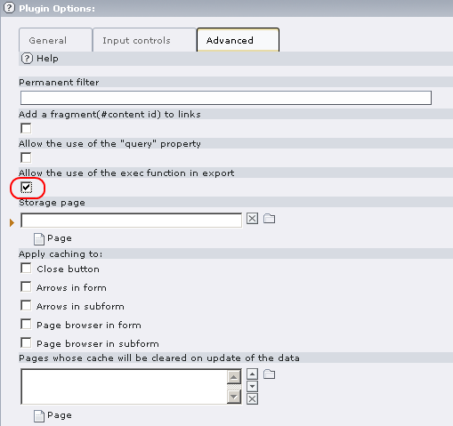

A XSLT file ( `http://xmlfr.org/w3c/TR/xslt/
<http://xmlfr.org/w3c/TR/xslt/>`_ ) is used to process the resulting
XML. Output can be transformed to virtually any file format. In this
example, it transforms docbook XML file before the FOP processing.

The Exec field is filled with the following input in order to call
FOP.

.. code-block:: bat

   fop -xml ###FILE### -xsl c:/Program Files/fop/xsl/fo/docbook.xsl -pdf ###SITEPATH###/fileadmin/test.pdf

The tag ###FILE### will be replaced by the resulting file name. The
xsl path for the file name docbook.xsl depends on your installation of
the FOP processor.

The tag ###SITEPATH### will be replaced by your site path. Here, the
generated file will be “test.pdf” in the “fileadmin” directory of the
site. It leads to the following caption.

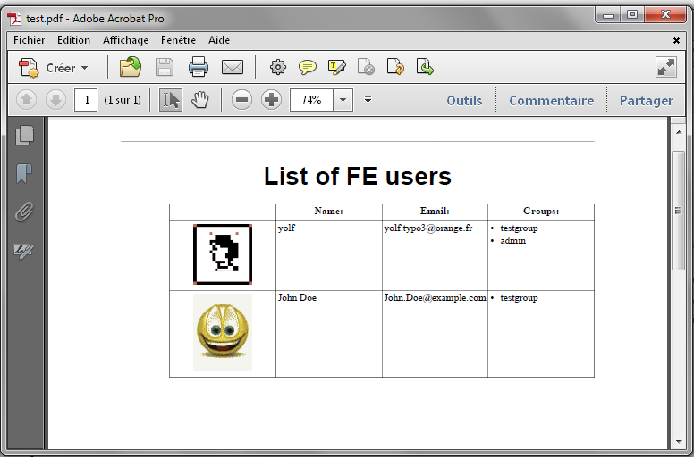

Using a query for exporting data
^^^^^^^^^^^^^^^^^^^^^^^^^^^^^^^^
A query may be used instead of using the export view fields to select the 
data to be exported. In order to do so, the user TS Config field or 
the group TS Config must contain the following line :

::

   sav_library_example8_ExportWithQuery = *

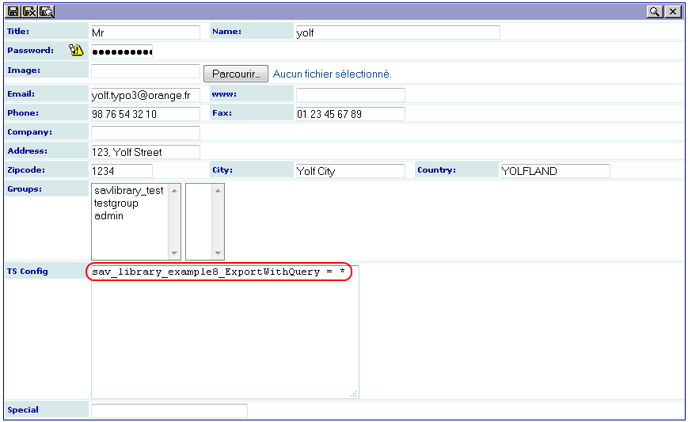

A new icon should be displayed in the export view.

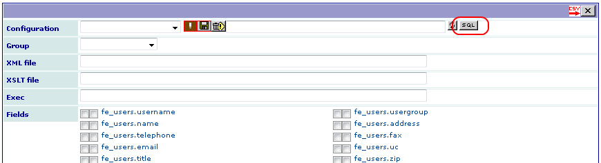

Clicking on this icon toggle the export view to the query mode where a query
can be entered. As it can be seen below, no field are displayed. 

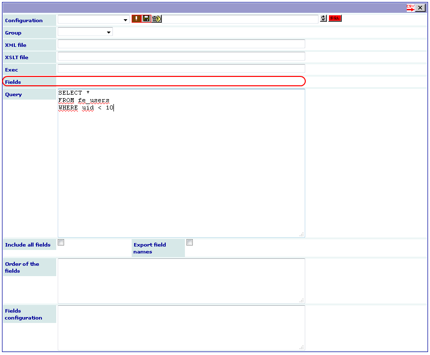

Click on the export icon to get the fields.

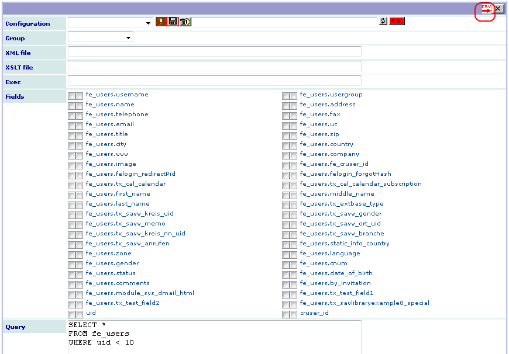

Finally, select the fields, fill the configuration if any and click again on 
export icon to get the CSV file.