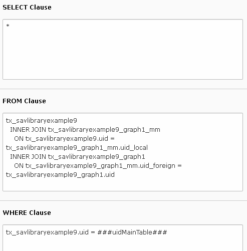

.. include:: ../../Includes.txt

.. _tutorial9_extensionOverview:

==================
Extension Overview
==================

Edit the extension `sav_library_example9 
<https://extensions.typo3.org/extension/sav_library_example9>`_
in the SAV Library Kickstarter to get an overview. It contains
one form with three conventional ``List``, ``Single`` and ``Edit`` views.

There is nothing special in the ``List`` view.

Edit View
=========

Two subforms are used to input the graph data. Even if another choice was possible
for the field ``graph1``, the use of a subform makes it possible to use similar queries 
for the graph.

- The subform ``graph1`` is configured to allow the input of one item. It is used to
  input the number of sunny, cloudy and rainy day in the month.
- the subform ``graph2`` is used to enter the minimal and maximal temperature for a given day.
  Note the field attributes used to add a delete button and up and down buttons in front of 
  each item.

  ::
  
     addDelete = 1;
     addUpDown = 1;

Single View
===========

The type of the field ``graph`` is :ref:`Graph <savlibrarykickstarter:graph>`. 
Its configuration includes the following properties.

:: 

   cutLabel = 1;
   graphTemplate = typo3conf/ext/sav_library_example9/Resources/Private/Templates/Charts.xml;
   allowQueries = 1;
   tags = 
      marker#uidQueryGraph1 = 1,
      marker#uidQueryGraph2 = 2,
      marker#uidMainTable = ###uidMainTable###,
   ;
   
Analyze the graph template ``Charts.xml`` provided in the folder
``Resources/Private/Templates`` of the extension.

The markers ``marker#uidQueryGraph1``  and ``marker#uidQueryGraph2`` are used in the
definition of the query manager. You could have to modify the value 1 and 2 as explained
in the next section. The marker ``marker#uidMainTable`` takes the value of the current
``uid`` of the main table, i.e. ``tx_savlibraryexample9``. This value is always available
by means of the marker ``###uidMainTable###``.

::

   <query id="graph1">
       <setQueryManager name="savcharts" uid="marker#uidQueryGraph1" uidMainTable="marker#uidMainTable" />
   </query>
   ...
   <query id="graph2">
       <setQueryManager name="savcharts" uid="marker#uidQueryGraph2" uidMainTable="marker#uidMainTable" />
   </query>

Queries
=======

Add two Sav Charts queries in backend list mode. The following caption shows the 
result with queries inserted in the ``Data`` folder.

Fill the query ``Query Graph 1`` as shown below.

The subforms used for the field ``graph1`` and ``graph2`` generates relations n:n. 
Therefoe, the ``FROM`` clause joins the tables ``tx_savlibraryexample9``,
``tx_savlibraryexample9_graph1_mm`` and ``tx_savlibraryexample9_graph1``. 

::

   tx_savlibraryexample9
   INNER JOIN tx_savlibraryexample9_graph1_mm
       ON tx_savlibraryexample9.uid = tx_savlibraryexample9_graph1_mm.uid_local
   INNER JOIN tx_savlibraryexample9_graph1
       ON tx_savlibraryexample9_graph1_mm.uid_foreign = tx_savlibraryexample9_graph1.uid
       
The ``WHERE`` clause retricts the records to the one used by the ``Single`` view. The marker
``###uidMainTable###`` does the job.

::

   tx_savlibraryexample9.uid = ###uidMainTable###
   
Fill the query ``Query Graph 2`` by replacing respectively
``tx_savlibraryexample9_graph1`` and ``tx_savlibraryexample9_graph1_mm`` by
``tx_savlibraryexample9_graph2`` and ``tx_savlibraryexample9_graph2_mm``.

.. important::

  The uid of the Sav Charts queries should be 1 and 2. However, if you do have already enter
  other Sav Charts queries their uid will be different. You can modify the values in the
  ``tags`` property of the field ``graph`` in the ``Singe`` view and regenerate the extension.
  
  You may also change the configuration using the :ref:`field 
  configuration <changingTheFieldConfiguration>`, for example at the
  extension level. The following TypoScript sets the values of the
  markers ``marker#uidQueryGraph1``  and ``marker#uidQueryGraph2``
  respectively to 3 and 4.
  
  ::
  
     plugin.tx_savlibraryexample9_pi1.Default.singleView.fields.graph.tags (
        marker#uidQueryGraph1 = 3, 
        marker#uidQueryGraph2 = 4, 
        marker#uidMainTable = ###uidMainTable###
     )  

Enter data in the frontend as shown below.

Save, and go to the frontend.

