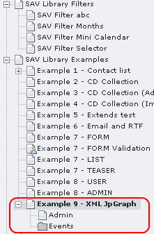
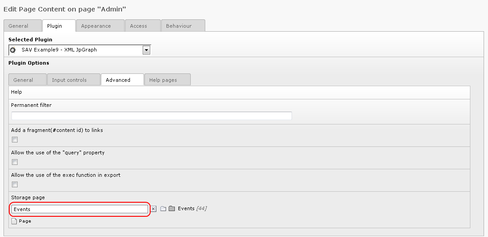
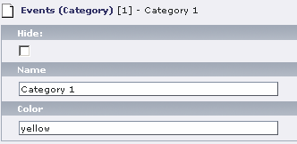
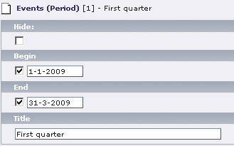
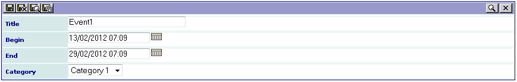
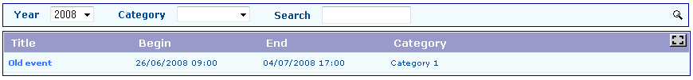

.. ==================================================
.. FOR YOUR INFORMATION
.. --------------------------------------------------
.. -*- coding: utf-8 -*- with BOM.

.. ==================================================
.. DEFINE SOME TEXTROLES
.. --------------------------------------------------
.. role::   underline
.. role::   typoscript(code)
.. role::   ts(typoscript)
   :class:  typoscript
.. role::   php(code)

FE input events (Admin)
-----------------------

If you have followed the previous tutorials, you are now familiar with
the SAV Library Extension Generator. The “Admin” form has three views:
“Admin\_List”, “Admin\_Single” and “Admin\_Edit”.

#. Download the extension “sav\_library\_example9” from the TER and open
   it in the Kickstarter.

#. Look at each folder tab and analyze the configuration of each field.

#. Create a page and a sysfolder as shown below.

- Insert the extension in the page “Admin” and configure the “Storage
  page” in the “Advanced tab” so that it points to the sysfolder
  (“Events” in the example).

- In the List mode (Web->List), create the categories and the periods in
  the sysfolder. Use color names recognized by JpGraph library. In this
  example, the year events are organized by quarters.

- Go to the Front End and insert events. Events are displayed in the
  “List” view by decreasing order of the begin date (see the “Order
  clause” in the “Admin\_Query”).

