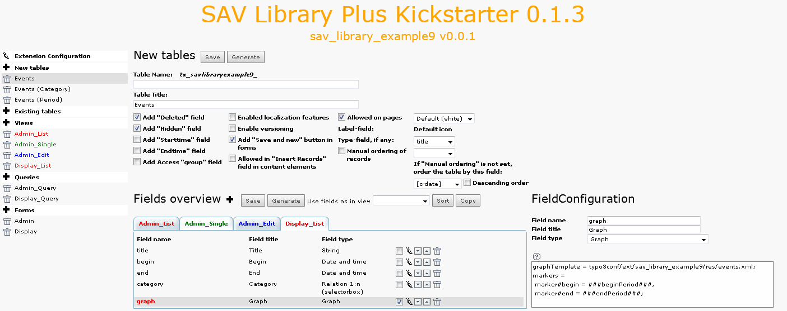
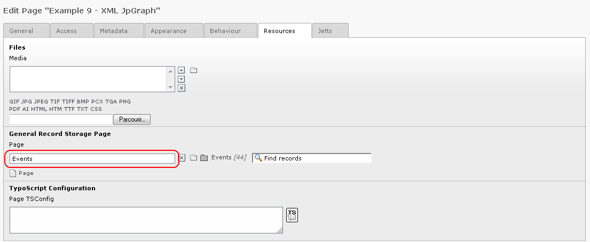

.. ==================================================
.. FOR YOUR INFORMATION
.. --------------------------------------------------
.. -*- coding: utf-8 -*- with BOM.

.. ==================================================
.. DEFINE SOME TEXTROLES
.. --------------------------------------------------
.. role::   underline
.. role::   typoscript(code)
.. role::   ts(typoscript)
   :class:  typoscript
.. role::   php(code)

Gantt graphs display (Display)
------------------------------

The “Display” form has only one view: “Display\_List”. This view
displays only one field named “graph”. Its configuration is the
following:

The fields with a type Graph are not created in the database. They are
displayed in the view if selected.

The configuration includes several lines:

::

   graphTemplate = typo3/ext/sav\_library\_example9/Resources/Private/Files/events.xml;

It defines the file to be used as a template for the graph display.

::

   markers = marker#begin = ###beginPeriod###, marker#end = ###endPeriod###;

This attribute is used to define XML SAV JpGraph
markers. The syntax is a comma-separated list of definitions. Let us
analyze the first one: “marker#begin = ###beginPeriod###”. It says
that the “marker” whose id is “begin” in the template will be replace
by the SAV Library marker “###beginPeriod###”, that is by the alias
“beginPeriod”. Thus it is necessary for this alias to be defined as
shown in the query section of the form.

Now, download the extension “sav\_jpgraph” from the TER and install
it.

Then, install the extension in the page where you want to display the
graph.

- In page properties, set the General Record Storage Page to the
  sysfolder containing your events.

- In the folder tab “Input controls”, uncheck “Input on form”.

- Save and go to your Front End page. You should obtain something
  similar to the following view, depending on your events.

.. figure:: ../../Images/Tutorial9GraphListView.png

- Finally, open the files “events.xml” and “eventsTemplate.xml” in the
  directory “Resources/Private/Files” of the extension and analyze them.
  The file “eventsTemplate.xml” is the general template for the graph
  display (see the extension “sav\_jpgraph” for more details). The file
  “events.xml” contains the user definitions for the references used in
  the general template. The only tricky part is the use of the SQL
  variable @row to number the position of the bar plots.

