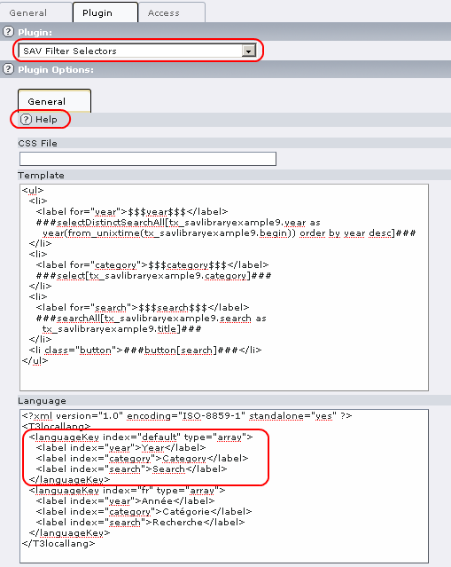
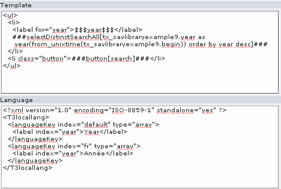
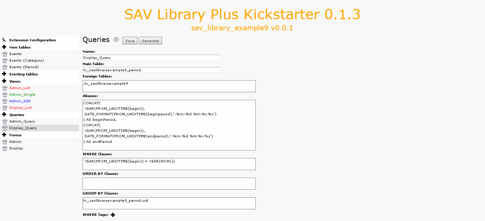
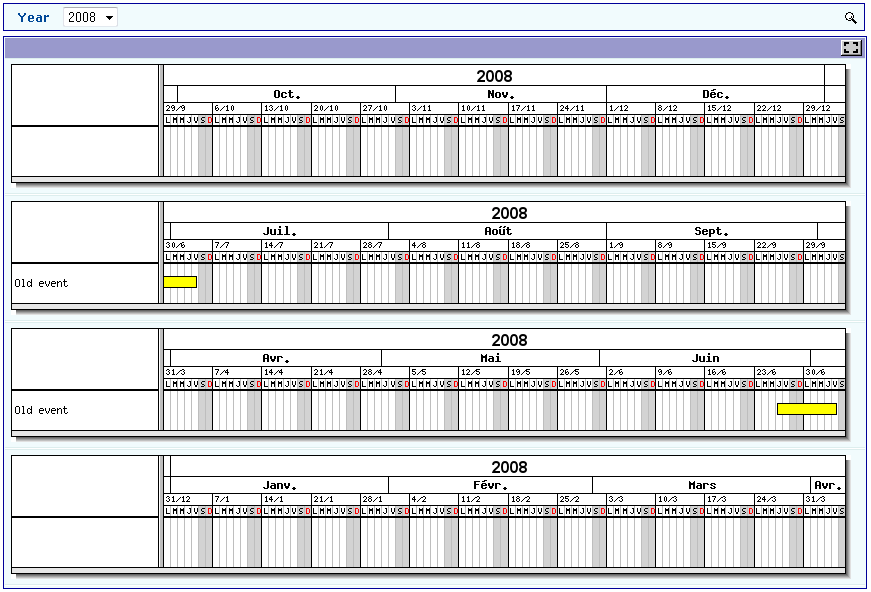

.. ==================================================
.. FOR YOUR INFORMATION
.. --------------------------------------------------
.. -*- coding: utf-8 -*- with BOM.

.. ==================================================
.. DEFINE SOME TEXTROLES
.. --------------------------------------------------
.. role::   underline
.. role::   typoscript(code)
.. role::   ts(typoscript)
   :class:  typoscript
.. role::   php(code)

Using the graph with a year selector
------------------------------------

To introduce a year selector, we are going to use a new filter called
“SAV Filter Selectors”.

- Download the extension “sav\_filter\_selectors” from the TER and
  install it. Let us note that this extension is very useful to develop
  quickly selectors, checkboxes, radio buttons, search boxes which can
  be used to filter extensions produced by means of the SAV Library
  Kickstarter... even if the syntax is sometimes surprising!

Using a selector in the “Admin” form
^^^^^^^^^^^^^^^^^^^^^^^^^^^^^^^^^^^^

- In the “Admin” page, add a plugin content element and select
  “sav\_filter\_selectors”.

- In the flexform, add the configuration as shown below. The template
  part is an HTML template which may contain special markers that will
  be replaced by the extension (see the CSH or the manual for details).
  It may also contain localization markers which must, in that case, be
  defined in the language section. In the example localization is used
  for markers $$$year$$$, $$$category$$$ and $$$search$$$ which are
  defined in English and in French. You can add your own language or
  replace the French part. If you do so, do not forget to modify the
  index attribute according to your language.

- Save and go to your “Admin” page. The extension
  “sav\_filter\_selectors” displays selectors for the year and
  categories and a search box. By default, events are displayed for the
  current year, thanks to the “Where clause” in the “Admin\_Query”. You
  can use the selector to select events for a given year and/or a
  category.

.. figure:: ../../Images/Tutorial9AdminListView.png

Using a selector with the “Display” form
^^^^^^^^^^^^^^^^^^^^^^^^^^^^^^^^^^^^^^^^

Let us now analyze how to introduce a selector with the “Display” form
which is a little bit more tricky.

- In the display page, add a plugin content element and select
  “sav\_filter\_selectors”. In the flexform, add the configuration shown
  below.

- Now, let us explain the tricky part. The “Display” form refers to the
  table “tx\_savlibraryexample9\_period” but the aliases “beginPeriod”
  and “endPeriod” depend now on the selected year. Therefore, they must
  be built using the year of the selected events, that is information in
  the “tx\_savlibraryexample9”. For that we need to build a query which
  will take into account this new table which is not joined with the
  period table. The “foreign table” field can be used for that. Be
  careful, the coma is required before the table name in this field.
  Modify the query as shown below:

- Finally go to the front end, select a year and validate.

